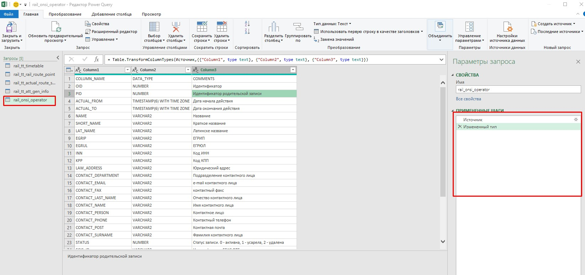
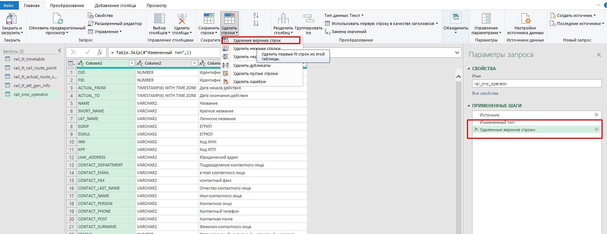
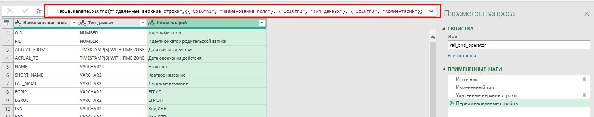
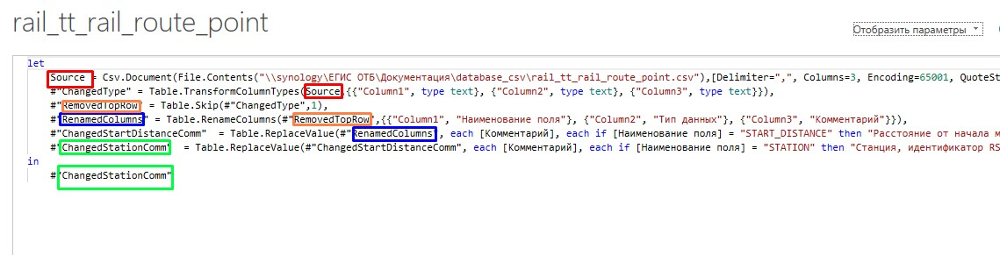

## Oracle

**Что делаем** : Получаем скриптом таблицы (имя колонки, тип данных, комментарий), пишем в CSV файлики. Опционально используем excel, для приведения к нормальному виду и замены комментариев (у нас к некоторым полям расширенные комментарии и пометки, из базы автоматом получить не получится).

**Что нужно:**

- SQL Developer
- (опционально) Excel

**Что есть** выложено в папку `\\synology\database_csv`. Скрипты для выполнения выложены в папку `\\synology\database_csv\SQL`

**ВНИМАНИЕ!** В SQL Developer ***Tools** > **Preference** > **Environment*** установить Encoding = "UTF-8" и перезапустить
иначе в csv будут кракозябры. На всякий случай на рабочей нужно вернуть Encoding обратно. От греха на рабочей и СГК, чтобы не порушить чужие запросы быстренько проделываем все в отдельном инстансе.

В SQL Developer:

1. подключаемся к нужной базе (ПБД, ПБД-Т);
2. открываем **новое окно** для выполнения скрипта;
3. вставляем скрипт из файла SQL (например `SAT_get_proc_rail.txt`);
4. выполняем скрипт (кнопка F5);
5. в целевой папке появляются файлы CSV.

Пример скрипта для парсинга одной таблицы. В скрипте можно выполнить таких сразу много:

```sql
-- Тут в кавычках указываем путь, куда сохранять таблицу
spool '\\synology\database_csv\rail_tt_timetable.csv';
    select /*csv*/ comm.column_name, cols.data_type, comm.comments  
    from all_col_comments comm
        join all_tab_cols cols on comm.table_name=cols.table_name and comm.owner=cols.owner and comm.column_name=cols.column_name
    -- Владелец (owner) таблица aka "Other Users" и имя таблицы
     where comm.owner = 'RAIL_TIMETABLE2'
        and comm.table_name = 'TIMETABLE'
    order by comm.table_name, cols.column_id;
```

## PostgreSQL

Для получения информации по таблицам из PostgreSQL нужно использовать скрипт PLSQL, который можно выполнить только из консоли psql.exe (в директории `\runtime` pgadmin).

Чтобы подключаться к БД без пароля нужно на локальном компьютере в файл `%APPDATA%\postgresql\pgpass.conf` добавить параметры подключения и пароль в формате:

```
hostname:port:database:username:password

# Например:
192.168.70.91:5433:vzh:postgres:postgres
```

Чтобы не указывать каждую БД отдельно, если для все них пароль одинаковый, можно заменить звездочкой:

```
192.168.70.91:5433:*:postgres:postgres
```

Сами скрипты для считывания инфы по таблице складываем в файл .sql. **Файл должен быть сохранен в кодировке ANSI** (на Windows). Пример скрипта `TEST_pg_get.sql`:

```
\copy (SELECT c.column_name as "Наименование поля",c.data_type as "Тип данных",pgd.description as "Комментарий" FROM pg_catalog.pg_statio_all_tables as st inner join pg_catalog.pg_description pgd on (pgd.objoid=st.relid) inner join information_schema.columns c on (pgd.objsubid=c.ordinal_position and  c.table_schema=st.schemaname and c.table_name=st.relname) where c.table_schema = 'ACS1_1' and c.table_name = 'CONTROL_LOG') To 'D:\test\test_file.csv' With delimiter ',' csv;
```

Чтобы запустить все одним кликом, можно использовать BAT файл вида:

```
@echo off
chcp 1252
REM Passowrd is stored in %APPDATA%\postgresql\pgpass.conf
REM Format is hostname:port:database:username:password

SET host=192.168.70.91
SET port=5433
SET db=vzh
SET user=postgres
set dir="C:\Program Files (x86)\pgAdmin 4\v4\runtime" 

%dir%\psql.exe -h %host% -p %port% -d %db% -U %user% -f TEST_pg_get.sql
```

В файле можно менять переменные с адресами подключения к БД и путь к `\runtime` pgadmin.

## Excel

Excel поддерживает удобный импорт из CSV. Пример настройки подключения к файлам CSV можно посмотреть в файле `_RAIL_Database.xlsx` (`\\synology\database_csv`).

Импорт данных из CSV файла:

1. если это новый файл - сначала его нужно сохранить (иначе инструменты будут недоступны);
2. на вкладке Данные выбрать **Получить данные** > **Из файла** > **Из текстового/CSV файла**;
3. указать путь к CSV файлу и нажать кнопку **Импорт**;
4. Excel автоматически распознает разделитель (",") и рассует значения по колонкам;
5. в выпадающем списке сверху выбрать кодировку **65001: Юникод (UTF-8)**;
6. нажать **Загрузить**.

Дальше табличку можно отформатировать как нравится (я обычно назначают дефолтный стиль).

Чтобы переименовать заголовок, убрать лишние строки и, возможно, изменить комментарии для колонок, которые нам уже известны, можно использовать редактор запросов (Power Query). Вообще это очень мощный Excel инструмент (на котором, как известно, держится вся мировая экономика).

1) Перейти на вкладку **Данные**. Выбрать **Получить данные** и выбрать в списке **Запустить редактор запросов**. Откроется редактор;
2) слева в панельке будут перечислены существующие в документе запросы (файлы);
3) выбрать запрос для редактирования:



Например, удалим лишнюю строку сверху (которая с `COLUMN_NAME`). Для этого выбрать на панели **Главная** инструмент **Удалить строки** и указать **Удаление верхних строк** . Ввести количество строк (1 в нашем случае) и нажать ОК. Все изменения и трансформации применяются к таблице по очереди, одна за другой (панель Примененные шаги). Любой шаг можно удалить прямо из этой панели.



Затем переименуем заголовок таблицы. Для этого нужно кликнуть ПКМ по полю заголовка, выбрать в контекстном меню **Переименовать** и ввести новое значение. В строке над таблицей все наши операции (переименование, замена и т.д. записываются в форме языка Power Query).



Теперь у нас к некоторым таблицам уже есть расширенные комментарии, которые хотелось бы сохранить и не удалять при обновлении, тем более что комментарии меняются очень редко и в базе в них есть ошибки. Это тоже можно сделать с помощью Power Editor. Рассмотрим пример. Для таблицы `TT RAIL ROUTE_POINT` я хочу заменить `Комментарий` к полю `STATION`.
Для замены значений ячейки есть специальный инструмент на вкладке **Преобразование** > **Замена значений** . Однако этот инструмент ищет текст для замены по значению ячейки, а нам нужно заменить ячейку на основании текста другой ячейки, так что придется использовать расширенный редактор Power Query.

Чтобы открыть расширенный редактор, нужно перейти на вкладку **Просмотр** и выбрать **Расширенный редактор**. Откроется окно с перечислением всех существующих шагов трансорфмациии, примененных к таблице. На рисунке можно видеть, что изменила русские названия типа "Источник", "Заменить значение" на латинские для удобства. Как видно, каждый шаг применяется к предыдущемему: в скобках первое значение всегда название предыдущего шага. И в последней строке скрипта записывается название последнего шага.



Для того чтобы заменить значение, будем использовать условную ссылку на ячейку. Формула выглядит так:

```
= Table.ReplaceValue(#"НАЗВАНИЕ_ПРЕДЫДУЩЕГО_ШАГА", each [Комментарий], each if [Наименование поля] = "НАЗВАНИЕ_ПОЛЯ" then "ТЕКСТ, КОТОРЫЙ ХОТИМ ВСТАВИТЬ В КОММЕНТАРИЙ" else [Комментарий],Replacer.ReplaceValue,{"Комментарий"})
```

Например:

```
= Table.ReplaceValue(#"RenamedColumns", each [Комментарий], each if [Наименование поля] = "START_DISTANCE" then "Расстояние от начала маршрута. Записывается любое число до 99999" else [Комментарий],Replacer.ReplaceValue,{"Комментарий"})
```

## Альтернатива

Альтернатива существует в виде инструмента https://foliant-docs.github.io/docs/:

- для PostgreSQL: https://foliant-docs.github.io/docs/tutorials/db/pgsql/
- для Oracle: https://foliant-docs.github.io/docs/tutorials/db/oracle/#documenting-oracle-database

