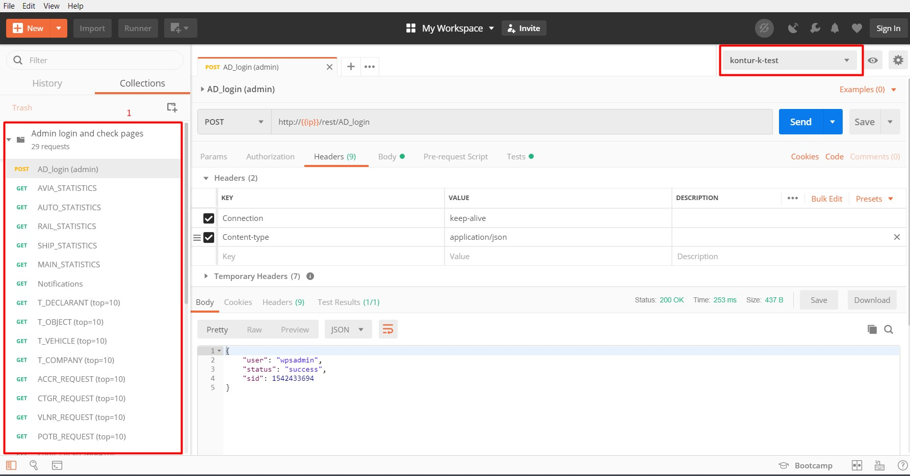
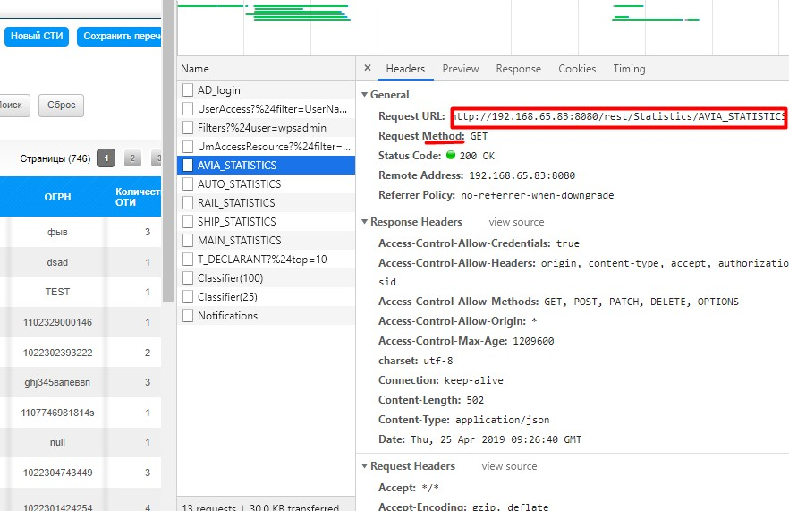
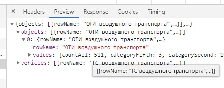
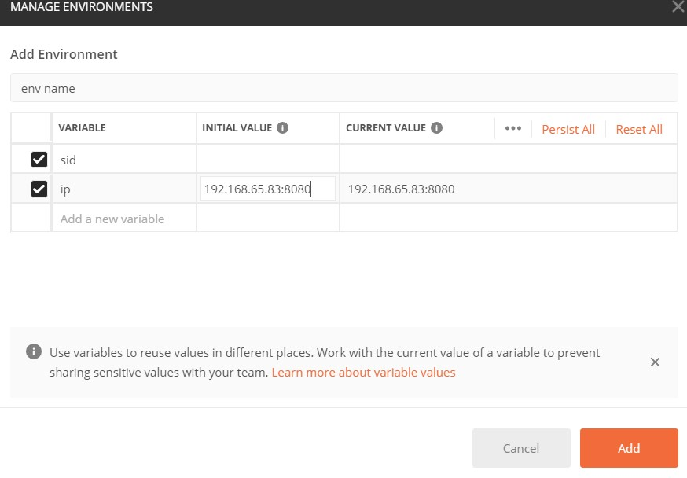
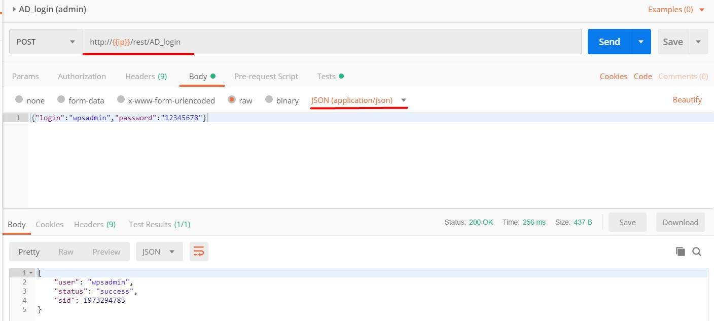
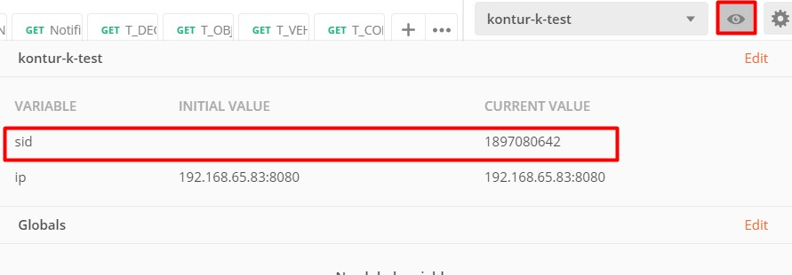
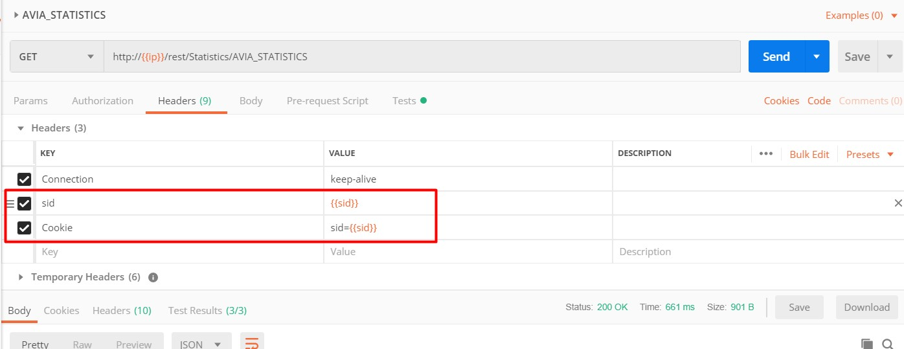
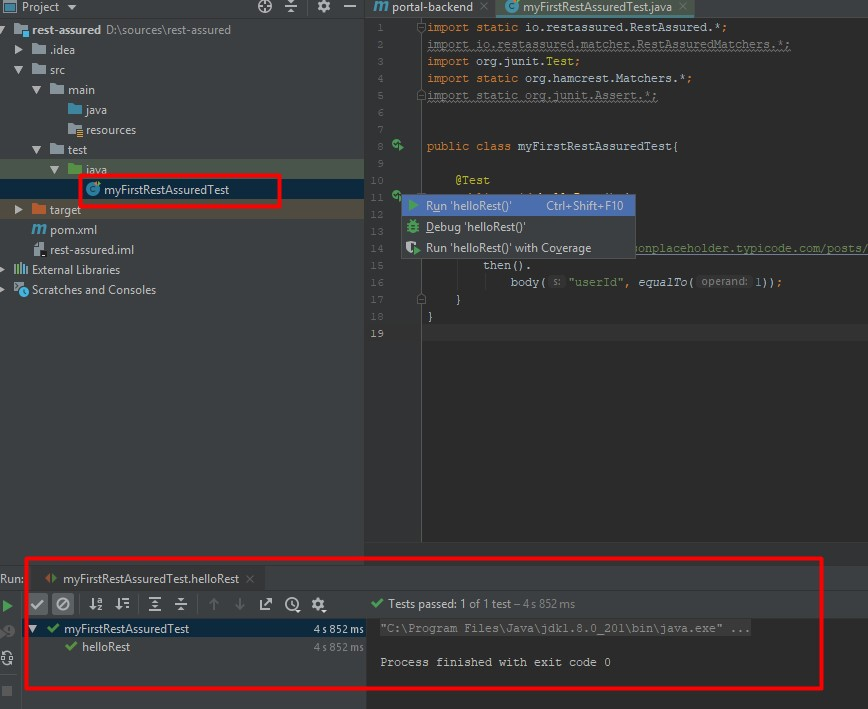
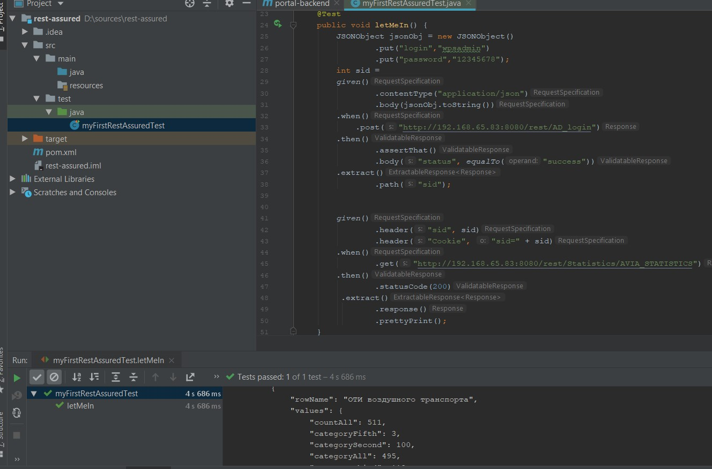

## Термины, инструменты

[REST](https://ru.wikipedia.org/wiki/REST) (сокращение от англ. Representational State Transfer — «передача состояния представления») — архитектурный стиль взаимодействия компонентов распределённого приложения в сети. В сети Интернет вызов удалённой процедуры может представлять собой обычный HTTP-запрос (обычно «GET» или «POST»; такой запрос называют «REST-запрос»), а необходимые данные передаются в качестве параметров запроса.

Задачи по работе с REST-сервисами:

- документирование сервиса - автоматическая генерация документация из кода. Инструменты: [Swagger](https://swagger.io/) (swagger также умеет немножко тестить);
- тестирование сервиса:
  - [Postman](https://www.getpostman.com/) - (можно работать офлайн), REST-клиент для тестирования и документирования REST, поддерживает JavaScript для автоматизации;
  - [Rest-asured](http://rest-assured.io/) - java-реализация тестирования REST API.

# Postman

Postman представляет собой симпатичный REST-клиент с дополнительными функциями, которые упрощают тестирование: использование переменных, группировка запросов в коллекции, javascript для проверок, отчеты, среды исполнения. Также есть перехватчик (прокси), который позволяет перехватывать запросы и сохранять их в истории, очень удобно. Доступная [документация](https://learning.getpostman.com/docs/postman/launching_postman/installation_and_updates) с примерами. Минимальные навыки программирования для использования. Подойдет для тестирования небольших REST API и публикации онлайн документации по нему.

Загрузить Postman можно [тут](https://www.getpostman.com/downloads/) (есть версии для Windows, Mac и Linux). Можно зарегистрироваться, но это необязательно.
При запуске в нижней части экрана нажать неприметную ссылку "Skip signing in and take me straight to the app".

Главное окно:



В панели слева приведен перечень запросов.
В панели две вкладки: *History* (история выполненных запросов), *Collections* (запросы, организованные в коллекциях). Коллекцию запросов можно запускать сразу целиком.
В рабочей области справа выводится информация по запросу и ответу: заголовки, тело запросов и ответов. В верхнем правом углу выбрана текущая среда (environment), на рисунке это - *kontur-k-test*. В [environment](https://learning.getpostman.com/docs/postman/environments_and_globals/manage_environments/) перечисляются общие переменные для среды (например, для запуска на СГК или на тестовой).

Если вы совсем не знаете или не встречали HTTP и REST-сервисы раньше, то посмотреть как он работает проще всего через веб-браузер (если в проекте есть какой-то веб-интерфейс). В Chrome и Firefox нужно открыть консоль разработчика (F12) и перейти на вкладку *Network*, а потом либо открыть ссылку с HTTP-запросом, либо открыть веб-интерфейс и понажимать в нем разные страницы и кнопки. На вкладке *Networks* будут появляться все запросы, которые браузер отправляет серверу, и все ответы, которые сервер передает браузеру. Можно рассмотреть, что передается в запросе, что в ответе, как выглядит URI.

Например, на рисунке видно Request URL: `http://{{ip}}/rest/Statistics/AVIA_STATISTICS`, метод (GET). То есть мы запрашиваем REST сервис передать нам статистику по воздушному транспорту.



Если переключиться на вкладку *Preview* или *Response*, то можно посмотреть, что сервер передал браузеру в ответе. В данном случае информация передается в формате [JSON](https://ru.wikipedia.org/wiki/JSON).



## Аутентификация

Postman поддерживает несколько типов аутентификации, однако, например, на портале контура К пароль передается в запросе к AD_login, а в ответе передается идентификатор сессии (sid) и куки. В дальнейшим аутентифицированные запросы передаются с sid и cookie в заголовке. Как достать переданный sid и cookie и использовать в последующих запросах? Для этого используем переменную sid и java script. Пример ниже приведен для портала импортозамещенного контура К ([http://192.168.65.83:8080](http://192.168.65.83:8080/)).

1. для группировки запросов можно создать коллекцию. Для этого нажать кнопку *New > Collections* и ввести название;

2. создать в коллекции запрос: правой кнопкой по коллекции > *Add Request*. Также можно сначала настроить параметры запроса в рабочей области, а потом нажать кнопку *Save* (справа) и выбрать коллекцию для сохранения;

3. переменные хранятся в *Environment*. Сначала ее нужно создать: *New > Environment*. Ввести имя и создать переменную ***sid*** (initial и current value можно оставить пустыми). Я также создала переменную ***ip***, в которую записала ip-адрес портала;
   

4. в рабочей области выбрать метод: POST и ввести *Request url* запроса к методу авторизации REST-сервиса. Для контура К это `http://{{ip}}/rest/AD_login`. Обращение к переменной - в двойных фигурных скобках: `{{ip}}`.

5. для контура К никаких параметров (Params) в этом запросе передавать не надо, переключаемся на вкладку Body. Ставим переключатель *raw*, выбираем тип JSON (application/json) и вставляем логин и пароль к порталу К в формате JSON: `{"login":"wpsadmin","password":"12345678"}`. Можно заметить, что на вкладке *Headers* автоматически добавился Header *Content-Type*;

6. проверяем запрос: нажимаем кнопку *Send*. В нижней части рабочей области на вкладке *Body* отобразится ответ (в формате JSON), в котором нам передали имя пользователя, статус аутентификации (success/failed) и номер сессии - sid;
   

7. чтобы сохранить полученный `sid` в запрос нужно добавить скрипт. Для этого в запросе переключиться на вкладку *Tests* (есть еще вкладка Pre-request Script - там выполняются скрипты ДО отправки запроса, а Tests - ПОСЛЕ). В поле вставить скрипт:

   ```javascript
   // читаем тело ответа
   var jsonData = JSON.parse(responseBody);
   // получаем значение sid из json ответа и сохраняем его в переменную sid
   postman.setEnvironmentVariable("sid", jsonData.sid);
   ```

8. сохранить запрос и выполнить его еще раз. Текущее значение (*Current value*) переменной можно посмотреть, нажав на кнопку с "глазом" рядом с текущей Environment в правом верхнем углу:

   

9. теперь в следующем запросе (например, запрос для получения статистики), передадим наш сохраненный идентификатор сессии в заголовках (Headers). Теперь запрос будет авторизованным и выполнится успешно. Конкретные заголовки для других REST-сервисов могут отличаться (например, cookie могут иметь совсем другой вид).

   


# Rest Asured

Всякие ссылки и источники:

- [Официальная документация](https://github.com/rest-assured/rest-assured/wiki/Usage;)
- [Rest assured: Полезные советы](https://habr.com/ru/post/421005/) (рус);
- [Rest assured: Various guides](https://james-willett.com/?s=rest+assured) (англ.) - блог, несколько статей. Начинать снизу.

## Up and running with IDEA

Если вы уже знаете, как работать с IDEA, как создать проект и настроить maven, смело пропускайте это главу и идите сразу в.... [документацию Rest-assured](https://github.com/rest-assured/rest-assured/wiki/GettingStarted#rest-assured)).

1. Скачиваем и устанавливаем [Java SDK 1.8](https://www.oracle.com/technetwork/java/javaee/downloads/jdk8-downloads-2133151.html).

2. [Скачиваем](https://www.jetbrains.com/idea/download/#section=windows) и устанавливаем IDEA Community. Я ставлю все по умолчанию.

3. Запускаем IDEA. Делаем первую настройку (я тоже все обычно по умолчанию оставляю, если что потом можно перенастроить). На экране *Welcome to IntelliJ IDEA* нажимаем *Create New Project*.

4. В панели слева выбираем [Maven](https://maven.apache.org/). Maven - это такая штука, которая загружает нужные нам библиотеки автоматически (чтобы самим не бегать по интернету и не загружать их). Все оставляем по умолчанию, нажимает *Next*.

5. Далее нужно указать <GroupId> и <ArtifactId> (Version можно оставить по умолчанию). Вы можете придумать свои, или использовать <groupid> и <artifactid> проекта, с которым работаете. Немножко про pom.xml, его значения и что для чего нужно [тут](https://www.apache-maven.ru/project-file.html) написано. Например:

   ```
      <groupId>ru.protonservice.egis-otb</groupId>
      <artifactId>portal-backend</artifactId>
   ```

6. Далее укажите имя проекта (*Project name*), читаемое, понятное и кратко передающее суть (например, *rest-assured*) и укажите путь, где будут хранится ваши сорсы. Нажмите *Finish*.

7. IDEA сама создаст все нужные папочки src/main и src/test. Автоматически будет открыт pom.xml - основной файл Maven вашего проекта. В этот файл нужно добавить вот такие строки (сразу после <version>):

   ```
       <dependencies>
              <dependency>
                  <groupId>io.rest-assured</groupId>
                  <artifactId>rest-assured</artifactId>
                  <version>3.3.0</version>
                  <scope>test</scope>
              </dependency>
   
              <dependency>
                  <groupId>org.hamcrest</groupId>
                  <artifactId>hamcrest-all</artifactId>
                  <version>1.3</version>
              </dependency>
   
              <dependency>
                  <groupId>junit</groupId>
                  <artifactId>junit</artifactId>
                  <version>4.12</version>
              </dependency>
   
              <dependency>
                  <groupId>pl.pragmatists</groupId>
                  <artifactId>JUnitParams</artifactId>
                  <version>1.1.1</version>
              </dependency>
             <dependency>
                  <groupId>org.json</groupId>
                  <artifactId>json</artifactId>
                  <version>20180813</version>
              </dependency>
          </dependencies>
   ```

   Мы сказали Maven загрузить четыре библиотеки (нажмите ссылку *Enable Auto-Import* в всплывающем сообщении Maven правом нижнем углу, что Maven все автоматически загрузил):

- Rest-assured - собственно он сам;
- [Hamcrest](http://hamcrest.org/) - помогает писать проверки лучше (*write better assertions*);
- [Junit](https://ru.wikipedia.org/wiki/JUnit) - фреймворк для тестирования;
- [JUnitParams](https://github.com/Pragmatists/JUnitParams)) - библиотека, которая делает жизнь немножко проще, позволяя параметризовать тесты;
- [json](https://github.com/stleary/JSON-java) - удобная библиотека для работы с JSON.

Для теста можно использовать, например, [JSONPlaceholder](https://jsonplaceholder.typicode.com/). Примеры ниже кроме первого будут для портала контура К ([http://192.168.65.83:8080](http://192.168.65.83:8080/)).

Есть несколько способов писать тесты, ниже я расскажу про самый простой: Given/When/Then:

- given - здесь мы указываем параметры запроса;
- when - URL запроса;
- then - что нужно проверить в ответе.

## Первый запрос

Создадим первый запрос, пусть это будет HTTP GET. Для теста используем URL (можно открыть в браузере): https://jsonplaceholder.typicode.com/posts/1. Он возвращает вот такой ответ:

```
{
  "userId": 1,
  "id": 1,
  "title": "sunt aut facere repellat provident occaecati excepturi optio reprehenderit",
  "body": "quia et suscipit\nsuscipit recusandae consequuntur expedita et cum\nreprehenderit molestiae ut ut quas totam\nnostrum rerum est autem sunt rem eveniet architecto" 
}
```

Проверим, что по этой ссылке нам будет возвращен ответ, в теле которого содержится userId и он равен "1".

В папке src\test\java создадим наш первый класс, назовем его, например `myFirstRestAssuredTest`. Сначала нужно импортировать библиотеки. Для первого теста понадобятся не все, но в дальнейшем они буду нужны. IDEA также может подсказать, когда нужны импортировать библиотеки.

```java
import static io.restassured.RestAssured.*;
import io.restassured.response.Response;
import io.restassured.matcher.RestAssuredMatchers.*;
import org.junit.Test;
import static org.hamcrest.Matchers.*;
import static org.junit.Assert.*;
```

Дальше напишем вот такой тест (текст целиком):

```java
import static io.restassured.RestAssured.*;
import io.restassured.response.Response;
import io.restassured.matcher.RestAssuredMatchers.*;
import org.junit.Test;
import static org.hamcrest.Matchers.*;
import static org.junit.Assert.*;

public class myFirstRestAssuredTest{

    @Test
    public void helloRest() {
        given()
        .when()
            .get("https://jsonplaceholder.typicode.com/posts/1")
        .then()
            .body("userId", equalTo(1));
    }
}
```

В `given()` мы ничего не указали, так как пока что ничего не передаем. Указали в `when` тип запроса (`get`) и адрес. В `then` попросили проверить, что значение `userId` равно единице.

**!\* \*Обратите внимание** на расположение точек. Иногда их ставят в конце строки, иногда в начале (по сути это одна конструкция: `given().when().then())`. В документации и интернетах вам будут встречаться разные написания, например вот так:

```java
 public void helloRest() {
        given().
        when().
            get("https://jsonplaceholder.typicode.com/posts/1").
        then().
            body("userId", equalTo(1));
    }
```

Важно выбрать один стиль написания и придерживаться его по всему проекту.

Можно тест прямо сразу запустить. Для этого достаточно нажать на зеленую иконку слева от нашего класса `helloRest`. В нижней части IDEA появится панель, в которой будет отображаться процесс тестирования. У нас должно получиться `Process finished with exit code 0` (то есть - без ошибок). Ура, первый тест готов!



## И снова об аутентификации

Если у вас REST с аутентификацией, то придется проделать кое-какие манипуляции, прежде чем использовать все дальнейшие запросы. В нашем случае аутентификация включает:

- отправку сервису логина и пароля;
- получение в ответе статуса аутентификации и куки/идентификатора сессии с которым нужно выполнять все дальнейшие запросы.

Таким образом, нам нужно отправить POST запрос сервису и получить от него ответ. Разобрать полученный ответ и сохранить идентификатор сессии и куки в переменную. Приступим:

- создадим объект JSON c нашим логином и паролем;
- отправим POST нашему API, проверим, что статус в ответе = `success`, а затем сохраним из ответа значение `sid` в переменную `int sid`;
- теперь с полученным sid отправляем запрос GET на получение статистики (/rest/Statistics/AVIA_STATISTICS) и, чтобы воочию убедиться, что оно работает, попросим Rest Assured сохранить и красиво вывести в консоль ответ.

```java
import static io.restassured.RestAssured.*;
import static java.lang.System.*;
import io.restassured.http.ContentType;
import io.restassured.response.Response;
import io.restassured.matcher.RestAssuredMatchers.*;
import org.json.JSONObject;
import org.junit.Test;
import static org.hamcrest.Matchers.*;
import static org.junit.Assert.*;

public class myFirstRestAssuredTest{

    @Test
    public void letMeIn() {
        JSONObject jsonObj = new JSONObject()
                .put("login","wpsadmin")
                .put("password","12345678");
        int sid =
        given()
                .contentType("application/json")
                .body(jsonObj.toString())
        .when()
            .post("http://192.168.65.83:8080/rest/AD_login")
        .then()
                .assertThat()
                .body("status", equalTo("success"))
        .extract()
                .path("sid");

        given()
                .header("sid", sid)
                .header("Cookie", "sid=" + sid)
        .when()
                .get("http://192.168.65.83:8080/rest/Statistics/AVIA_STATISTICS")
        .then()
                .statusCode(200)
         .extract()
                .response()
                .prettyPrint();
    }

}
```

**Примечание:** Есть несколько способов извлекать JSON (иногда нужен весь ответ). Вот [тут](https://stackoverflow.com/questions/21166137/rest-assured-is-it-possible-to-extract-value-from-request-json) есть несколько примеров, как это можно сделать.

