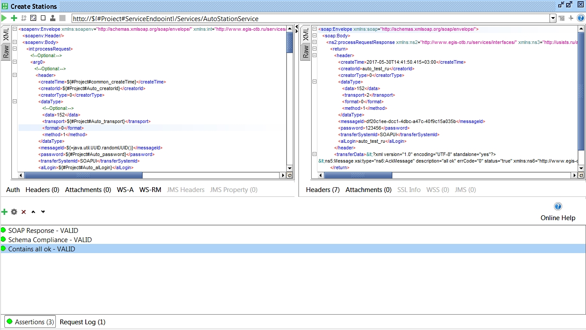
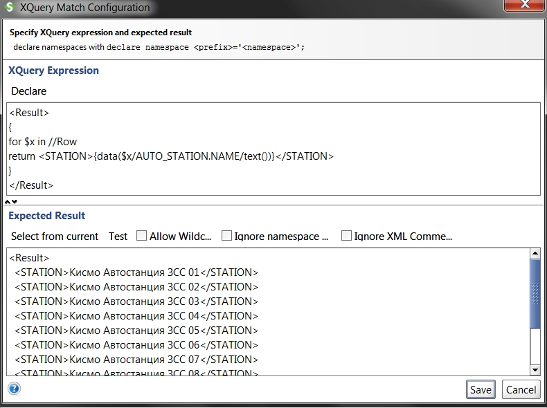

# SoapUI Автоматизация тестирования

SoapUI обладает большими возможностями по автоматизации тестов. Здесь будет много скриптов и примеров. Начальные навыки программирования приветствуются, но не обязательны.
Полезные примеры всяких скриптов и решений: 

* [Learning SoapUI](https://learnsoapui.wordpress.com/)
* [Сборник примеров скриптов](http://mkarthikeya.blogspot.ru/2011/11/soapui-groovy-snippets.html)
* [Подборка Groovy скриптов на гите](https://github.com/nmrao/soapUIGroovyScripts/tree/master/groovy)

## Подготовка, драйверы

Для базовой автоматизации (создания тест-кейсов, запуска подряд несколько запросов и простых скриптов) вам понадобится только сам SoapUI. Для продвинутых операций (подключение к БД, отправка на FTP) понадобится немного пошаманить:
Прежде всего нам понадобится:

- SoapUI 64 bit (гайд для версии 5.3.0). Если вы загружали SoapUI с сайта с большой кнопкой Download - скорее всего у вас версия x32 и лежит она в папке C:\Program Files (x86)\SmartBear. Нам же нужно скачать версию x64 вот здесь: https://www.soapui.org/downloads/latest-release.html
- драйвер JDBC для подключения к **postgreSQL**: https://jdbc.postgresql.org/download.html . Версия 4.2 (файл **postgresql-42.1.1.jar**);
- драйвер JBDC для подключения к **Oracle** приложен к этой статье - **ojdbc8.jar** ((если что, скачивать тут: http://www.oracle.com/technetwork/database/features/jdbc/jdbc-ucp-122-3110062.html , требуется регистрация)
- поставить **Java 1.8 версии 64**: http://www.oracle.com/technetwork/java/javase/downloads/jre8-downloads-2133155.html
- для продвинутых операций типа FTP загрузки нам также понадобится библиотека Apache commons Net (http://commons.apache.org/proper/commons-net/download_net.cgi) - файл **commons-net-3.6.jar** (в архиве commons-net-3.6-bin.zip), jar приложен к этой статье. Файл необходимо положить в папку C:\Program Files\SmartBear\SoapUI-5.3.0\bin\ext (см. ниже)

После этого:

- запустить один раз SoapUI;
- закрыть SoapUI;
- перейти в папку C:\Program Files\SmartBear\SoapUI-5.3.0 и **переименовать папку jre в jre.ignore** (или переместить в другую папку);
- положить скачанный файл драйвера postgresql-42.1.1.jar в папки: `C:\Program Files\SmartBear\SoapUI-5.3.0\bin\ext` и в `C:\Program Files\SmartBear\SoapUI-5.3.0\lib`;
- открыть SoapUi. В логе (в нижней панели есть SoapUI Log) должны быть записи вида *Used java version: 1.8.0_121* и *"Adding [C:\Program Files\SmartBear\SoapUI-5.3.0\bin\ext\postgresql-42.1.1.jar] to extensions classpath"*

Что мы сделали и зачем: по умолчанию SoapUI работает а Java 7, драйвер postgresql-42.1.1.jar дружит с java 8 - в результате скрипты не выполнятся из-за разных версий java. Поэтому мы убрали встроенную в SoapUi java (переименовав папку), заставив его работать с java, которая установлена на компьютере (java 8).

Теперь для oracle:

1) положить файл ojdbc8.jar в папки `C:\Program Files\SmartBear\SoapUI-5.3.0\bin\ext` и в `C:\Program Files\SmartBear\SoapUI-5.3.0\lib`;
2) в Oracle должен существовать юзер, с которым можно подключиться к БД (sys подключиться не даст). Создаем пользователя (логинимся в оракл как sysdba, на листе скриптов localoracle:

```sql
create user testadmin identified by oracle;

grant dba to testadmin;
```
3) строка подключения к oracle, например: `jdbc:oracle:thin:[testadmin/oracle@192.168.70.90](mailto:testadmin/oracle@192.168.70.90):1521:orcl`, драйвер oracle.jdbc.driver.OracleDriver

## Пример тест-кейса

Ниже описан простой тест-кейс, который состоит из шагов:

1. создать фильтры в БД;
2. выполнить запрос с созданием станций;
3. подключиться к БД и проверить, что отфильтрованы нужные станции, ненужные не отфильтрованы;
4. (дополнительно) очистить базу от тестовых данных.

### Создание Тест-кейса

Для примера я буду использовать мой существующий проект для тестирования Кисмо. В проекте уже созданы интерфейсы (`AutoStationBindingSoap`), запросы параметризированы, в свойствах проекта расставлены переменные (ip адрес, creatorId и т.д.). Все это описано в основной статье, считаю, что с этим уже разобрались.

1. Нажать ПКМ по существующему проекту и выбрать **New Test Suite**. Созданный Test Suite появится в дереве проекта, его можно переименовать (ПКМ - Rename). Test Suite - набор тест-кейсов, тест-кейс - набор "шагов". TestSuite можно выполнять целиком (то есть все включенные тест-кейсы). Например, можно создать один TestSuit, в котором есть 3 TestCase для каждого типа транспорта;
2. Нажать по созданному TestSuite ПКМ и выбрать **New Test Case**. TestCase появится в дереве TestSuite. Кейс можно переименовать (ПКМ - Rename);
3. Чтобы создать шаг теста, нужно нажать ПКМ по TestCase и выбрать тип создаваемого шага, например SOAP Request (наш обычный запрос) или JDBC Request:


### Шаг: Подключение к БД и выполнение скрипта

*!Предложенные ниже скрипты и решения вероятно не являются самыми оптимальными, возможно все можно упростить и сделать красивше :) Практика, гуглирование и чтение документации в этом помогут*.

Первым шагом теста будет создание фильтров. Для этого мы будем использовать Groovy-скрипт. Groovy - это язык программирования (надстройка для Java, [вики наше все](https://ru.wikipedia.org/wiki/Groovy)) . Нам пока будут нужны только самые простые конструкции, которые можно нагуглить или спросить у коллеги-программиста.

Для этого шага в принципе можно было бы использовать JDBC Request (подключение к БД), но для развесистых SQL запросов это не всегда удобно.

Итак, прежде всего, нам нужно зарегистрировать наш драйвер postgresql для всего проекта (*!в принципе это не обязательно, но если какой-то запрос к БД не работает по непонятной причине - прежде всего попробовать сделать это*). Для этого:

1. открыть ProjectViewer (кликнуть дважды по проекту);
2. в нижней панели перейти на вкладку Load Script (скрипты, который выполняются при загрузке проекта;
3. ввести в поле:

   ```
   com.eviware.soapui.support.GroovyUtils.registerJdbcDriver('org.postgresql.Driver')
   ```


4. теперь в нашем тест-кейсе (Project/TestSuite/TestCase) создадим шаг Groovy Scipt (ПКМ > Add Step > Groovy Script) - шаг будет помечен звездочкой;
5. откроется окно редактирования скрипта. Нам нужно подключиться к БД и выполнить несколько `INSERT` запросов для создания фильтров. Используем код:

```groovy
/*Регистрируем jdbc драйвер, Файл драйвера нужно скачать https://jdbc.postgresql.org/download.html здесь, версия 4.2
и положить в папки C:\Program Files\SmartBear\SoapUI-5.3.0\lib и C:\Program Files\SmartBear\SoapUI-5.3.0\bin\ext*/
com.eviware.soapui.support.GroovyUtils.registerJdbcDriver('org.postgresql.Driver')
import groovy.sql.Sql
import java.sql.Driver

/*Подключение к БД*/
def sql = Sql.newInstance("jdbc:postgresql://192.168.70.91:5432/ORA2PG_T","postgres","postgres","org.postgresql.Driver")

/*Выполняем скрипты между ''' (тройными одинарными кавычками)*/
sql.execute '''
INSERT INTO "GENERAL_ONSI"."FILTER" VALUES ('231', '2017-04-03 00:00:00', '2018-04-03 00:00:00', '0', '1', '^КИСМО АВТОСТАНЦИЯ ЗСС 01$', '2');
INSERT INTO "GENERAL_ONSI"."FILTER" VALUES ('232', '2017-04-03 00:00:00', '2018-04-03 00:00:00', '0', '2', '^КАЗСС03$', '2');
INSERT INTO "GENERAL_ONSI"."FILTER" VALUES ('233', '2017-04-03 00:00:00', '2018-04-03 00:00:00', '0', '3', '^KADSS05$', '2');
INSERT INTO "GENERAL_ONSI"."FILTER" VALUES ('234', '2017-04-03 00:00:00', '2018-04-03 00:00:00', '0', '4', '^ВЯЗЬМА$', '2');
INSERT INTO "GENERAL_ONSI"."FILTER" VALUES ('235', '2017-04-03 00:00:00', '2018-04-03 00:00:00', '0', '5', '^24403000000$', '2');
INSERT INTO "GENERAL_ONSI"."FILTER" VALUES ('236', '2017-04-03 00:00:00', '2018-04-03 00:00:00', '0', '6', '^РЕСПУБЛИКА КОМИ$', '2');
'''
```

Чтобы выполнить запрос нужно нажать зеленую кнопку "старт" в верхней панели окна редактирования запроса.

Первые три строчки кода - регистрация драйвера (еще разок на всякий случай), импорт классов для работы с SQL. В строке `def sql` - мы определяем подключение к БД (`def`- объявление переменной, `sql` - имя переменной), указываем строку подключения, логин, пароль и драйвер. sql.execute (имяПеременной.execute) выполняет по порядку все SQL команды. При успешном выполнении скрипта будет показано окошко `Script-result false`.

Этот скрипт, конечно, работает, но можно его немного улучшить. Так как мы можем перемещать наши тесты между разными площадками и IP, было бы здорово, если можно было поменять подключение в свойствах проекта (параметризация и свойства проекта описаны в разделах выше). Для этого в свойствах проекта создаем 3 новых переменные, я обозвала их:

| pgCon  | jdbc:postgresql://192.168.70.91:5432/ORA2PG_T |
| ------ | --------------------------------------------- |
| pgUser | postgres                                      |
| pgPass | postgres                                      |

Скрипт Groovy немного изменим, добавив вызов этих переменных:

```groovy
/*Регистрируем jdbc драйвер, Файл драйвера нужно скачать https://jdbc.postgresql.org/download.html здесь, версия 4.2
и положить в папки C:\Program Files\SmartBear\SoapUI-5.3.0\lib и C:\Program Files\SmartBear\SoapUI-5.3.0\bin\ext*/
com.eviware.soapui.support.GroovyUtils.registerJdbcDriver('org.postgresql.Driver')
import groovy.sql.Sql
import java.sql.Driver

/*Здесь мы объявляем переменные, значения которых достаем из свойств проекта (у меня переменные и в скрипте,
и в свойствах проекта названы одинаково*/
def pgCon = testRunner.testCase.testSuite.project.getPropertyValue( "pgCon" )
def pgUser = testRunner.testCase.testSuite.project.getPropertyValue( "pgUser" )
def pgPass = testRunner.testCase.testSuite.project.getPropertyValue( "pgPass" )

/*Здесь мы просто указываем объявленные ранее переменные*/
def sql = Sql.newInstance(pgCon,pgUser,pgPass,"org.postgresql.Driver")

sql.execute '''
INSERT INTO "GENERAL_ONSI"."FILTER" VALUES ('231', '2017-04-03 00:00:00', '2018-04-03 00:00:00', '0', '1', '^КИСМО АВТОСТАНЦИЯ ЗСС 01$', '2');
INSERT INTO "GENERAL_ONSI"."FILTER" VALUES ('232', '2017-04-03 00:00:00', '2018-04-03 00:00:00', '0', '2', '^КАЗСС03$', '2');
INSERT INTO "GENERAL_ONSI"."FILTER" VALUES ('233', '2017-04-03 00:00:00', '2018-04-03 00:00:00', '0', '3', '^KADSS05$', '2');
INSERT INTO "GENERAL_ONSI"."FILTER" VALUES ('234', '2017-04-03 00:00:00', '2018-04-03 00:00:00', '0', '4', '^ВЯЗЬМА$', '2');
INSERT INTO "GENERAL_ONSI"."FILTER" VALUES ('235', '2017-04-03 00:00:00', '2018-04-03 00:00:00', '0', '5', '^24403000000$', '2');
INSERT INTO "GENERAL_ONSI"."FILTER" VALUES ('236', '2017-04-03 00:00:00', '2018-04-03 00:00:00', '0', '6', '^РЕСПУБЛИКА КОМИ$', '2');
'''
```

Так как вообще-то этот шаг по сути не входит в тест, правильнее было бы его запихать в Setup Script (два раза кликнуть по Test Steps, в нижней панели будет вкладка Setup Script - туда можно записывать все скрипты, которые нужно выполнить перед началом теста - например загрузить тестовые данные). Но для целей этого гайда я сделала отдельный шаг.

### Шаг: Выполнение SOAP запроса и проверка

1. Теперь создадим шаг с SOAP запросом (ПКМ по тест-кейсу > Add Step > SOAP Request).
2. В проекте должен быть уже создан хотя бы один интерфейс: выбрать его из списка.
3. В следующем окне можно все оставить по умолчанию и сразу нажать ОК. Я отмечаю еще вторую и третью галочки.
4. Откроется стандартное окно SOAP запросов. Содержимое левой панели сразу грохнуть и вставить свой запрос на создание станций.
5. Выполнение запроса точно также запускается зеленой кнопкой в левом верхнем углу панели.

Когда запрос выполнен, нам нужно **проверить, что он выполнен успешно**. Индикатором этого будет наличие "all ok" в возвращенном запросе. Поэтому нам нужно вставить такую проверку, которая найдет "all ok" в ответе, и выдаст ошибку, если "all ok" там нет.

1) Для того чтобы вставить проверку или assertion, нужно нажать зеленый плюсик (рядом с кнопкой запуска запроса) или раскрыть панель **Assertion** в нижней части этого окна и нажать плюсик там, см скриншот (по умолчанию нижняя панель Assertion закрыта, и открывается только когда есть ошибки):



2) В окне **Add Assertion** представлен список возможных проверок. Нам сейчас нужна простая проверка - **Property Contains** > **Contains**. Выбрать ее и нажать **Add**.
3) В появившемся окне ввести в поле Content текст `"all ok"` (можно с кавычками) и нажать ОК.
4) Assertion появится в нижней панели и будет зеленой, если проверка пройдена, или красной с указанием ошибки. Assertion можно переименовать (ПКМ - Rename):


### Шаг: Подключение к БД и проверка фильтрации станций

Теперь, когда станции созданы, нам нужно проверить, что:

1. станции есть в БД;
2. нужные станции отфильтровали (статус `1`);
3. ненужные станции не отфильтровались (статус `0)`.

В моем случае есть несколько индикаторов успешности выполнения (это зависит от теста, данных, которые записываются, и ожидаемого результата), например:

1. станции, начинающиеся на указанное имя, должны существовать;
2. станций отфильтрованных не должно быть больше 6;
3. указанные станции должны быть отфильтрованы (6 штук);
4. указанные станции не должны быть отфильтрованы (другие 6 штук).

Для подключения к БД создадим JDBC Request (Add Step > JDBC Request). В окне запрос нужно указать параметры подключения в формате:

* **Driver**: org.postgresql.Drive
* **Connection Sting**: jdbc:postgresql://192.168.70.91:5432/ORA2PG_T?user=postgres&password=postgres

Кнопка Test Connection запускает проверку подключения. В поле ниже вводится SQL запрос к БД. Результаты запроса возвращаются в XML формате, вот так:


В данном случае запрос должен выбрать все станции, начинающиеся на Кисмо и с `Filtered=1`:

```sql
select "NAME", "FILTERED" from "AUTO_ONSI"."AUTO_STATION" WHERE ("NAME" LIKE 'Кисмо%' AND "FILTERED" = '1')
```

Точно также, как и в предыдущем шаге, нужно вставить Assertion (Проверку). Здесь представлены примеры разных проверок, на самом деле все они не нужны в данном случае, использую просто для примера:
Простые проверки:

- Простая проверка Property Content > Contains с текстом `rowNumber` . Проверяет, что по запросу вообще что-то найдено.
- Простая проверка Property Content > Contains с текстом `Row rowNumber="6"`. Проверяет, что есть по крайней мере 6 результатов.

Следующая проверка будет скриптом (Script > Script Assertion). Эту же проверку так же можно разбить на 6 простых проверок (Property Content > Contains) с именем каждой станции, но я хочу все сразу. Скрипт содержит все имена станций, который должны присутствовать в результатах:

```
responseData = messageExchange.getResponseContent()
log.info(responseData)
assert responseData.contains("<AUTO_STATION.NAME>Кисмо Автостанция ЗСС 01</AUTO_STATION.NAME>")
assert responseData.contains("<AUTO_STATION.NAME>Кисмо Автостанция ЗСС 03</AUTO_STATION.NAME>")
assert responseData.contains("<AUTO_STATION.NAME>Кисмо Автостанция ЗСС 05</AUTO_STATION.NAME>")
assert responseData.contains("<AUTO_STATION.NAME>Кисмо Автостанция ЗСС 07</AUTO_STATION.NAME>")
assert responseData.contains("<AUTO_STATION.NAME>Кисмо Автостанция ЗСС 09</AUTO_STATION.NAME>")
assert responseData.contains("<AUTO_STATION.NAME>Кисмо Автостанция ЗСС 11</AUTO_STATION.NAME>")
```

Следующая проверка посложнее и основана на **Xquery** - фактически, аналог SQL запроса к XML. Нам нужно, чтобы в возвращенных от базы данных результатах были только указанные станции, и никаких других. Для этого используем Property Content > **XQuery Match**.
Откроется окно редактирования проверки. В верхней части нужно написать запрос, в нижней части - то, что мы хотим увидеть. Например, для того чтобы вывести все станции, которые сейчас возвращены в результате запроса к БД, используем скрипт:

```
<Result>
{
for $x in //Row 
return <STATION>{data($x/AUTO_STATION.NAME/text())}</STATION>
}
</Result>
```

Этот скрипт проходит по каждому узлу Row (в xml это `Row rowNumber="1"`, `Row rowNumber="2"` и т.д.), смотрит в узел `AUTO_STATION.NAME`, берет оттуда текст (в нашем случае это название станции) и выводит все обнаруженные станции в список. Протестировать скрипт можно нажав кнопку **Select From Current** - в нижней части отобразится результат.



Мне нужно, чтобы в результате было выведено только 6 конкретных станций, поэтому в нижней части **Expected Result** я введу то, что ожидаю увидеть (только эти станции должны быть возвращены по запросу к БД и никаких лишних):

```
<Result>
  <STATION>Кисмо Автостанция ЗСС 01</STATION>  
  <STATION>Кисмо Автостанция ЗСС 03</STATION>
  <STATION>Кисмо Автостанция ЗСС 05</STATION>
  <STATION>Кисмо Автостанция ЗСС 07</STATION>
  <STATION>Кисмо Автостанция ЗСС 09</STATION>
  <STATION>Кисмо Автостанция ЗСС 11</STATION>
</Result>
```

Такая проверка покажет ошибку, если каких-то станций нет, или какие-то станции лишние. Xquery Match очень мощный инструмент, с его помощью можно разбирать возвращенные XML-запросы, делать условные проверки и многое другое.

Далее можно например еще создать проверки на то, что конкретная станция НЕ содержится в запросе (Property Content > Not Contains). Например, вот результат выполнения проверки после записи станций на нашей тестовой (где почему-то коряво работает фильтрация ФС). Отфильтровалось только 5 станций, проверки это обнаружили:

 

## Примеры выполнения конкретных операций

### Разбор XML-файла ответа веб-сервиса

**Tip**: извлечение xml из transferData в одну строку

```xml
transferData = new XmlHolder((new XmlHolder(messageExchange.getResponseContentAsXml())).getNodeValue("//*:transferData"))
transferData.getNodeValue("//*:data/@name") //работаем с xml в transferData
```

Веб-сервисы возвращают ответ в XML формате, данные же помещаются в CDATA в поле tranferData. Предположим, мы создали 3 оператора, обновили их запросили сервис (GET) созданных операторов и хотим проверить, что и как обновилось, правильно ли были помечены старые записи как удаленные.

Для этого есть два подхода:

- проверить в БД (JDBC Request);
- разобрать XML-ответ.

В каких-то случаях быстрее будет использовать запрос к БД, но иногда полезнее разобрать полученный ответ. Так же это можно использовать для более продвинутой автоматизации (например, сделать запрос на ОКАТО, прочитать значение и использовать это значение в следующем запросе).

Для начала разберем простой пример - проверим количество возвращенных записей и короткое имя перевозчика. Это ответ от сервиса с тремя операторами:

```xml
<soap:Envelope xmlns:soap="http://schemas.xmlsoap.org/soap/envelope/">
   <soap:Body>
      <ns2:processRequestResponse xmlns:ns2="http://www.egis-otb.ru/services/interfaces/" xmlns:ns3="http://usists.ru/asteros/data">
         <return>
            <header>
               <createTime>2017-06-01T11:54:31.543+03:00</createTime>
               <creatorId>auto_test_ru</creatorId>
               <creatorType>0</creatorType>
               <dataType>
                  <data>151</data>
                  <transport>2</transport>
                  <format>0</format>
                  <method>4</method>
               </dataType>
               <messageId>d4269757-0f32-4034-9eb4-4385eeff14d4</messageId>
               <password>123456</password>
               <transferSystemId>SOAPUI</transferSystemId>
               <alLogin/>
            </header>
            <transferData><![CDATA[<?xml version="1.0" encoding="UTF-8" standalone="yes"?>
<ns4:Message xsi:type="ns5:DataMessage" xmlns:ns6="http://www.egis-otb.ru/data/onsi/operators/" xmlns:ns5="http://www.egis-otb.ru/messaging/" xmlns:ns2="http://www.egis-otb.ru/data/timetable/delta/" xmlns:ns4="http://www.egis-otb.ru/datatypes/" xmlns:ns3="http://www.egis-otb.ru/data/onsi/rail/countries/" xmlns:xsi="http://www.w3.org/2001/XMLSchema-instance">
    <dataArray recordCount="3">
        <data xsi:type="ns6:Operator" egisId="22071" contactDepartment="Отдел транспортной безопасности" contactEmail="otb1@transport.ru" contactFax="84955086666" contactLastname="Ларионов" contactName="Леонид" contactPerson="Заместитель директора" contactPhone="84951236666" contactPost="143456, г. Саратов, ул. Ленина, д. 2, вл. 5" contactSurname="Васильевич" egrul="5077746887312" latName="Operator 1" lawAddress="143456, г. Саратов, ул. Ленина, д. 2, вл. 5" name="Перевозчик 1" shortName="ПЕРЕВ1" state="active" isgid="1281" isuid="1883" sourceId="testPmiPasAO6201" id="25112">
            <actualPeriod xsi:type="ns4:DateTimePeriod" from="2017-05-25T10:34:00.000Z" to="2018-06-01T10:34:00.000Z"/>
        </data>
        <data xsi:type="ns6:Operator" egisId="22072" contactDepartment="Отдел транспортной безопасности" contactEmail="otb2@transport.ru" contactFax="84955086666" contactLastname="Сидоров" contactName="Петр" contactPerson="Заместитель директора" contactPhone="84951236666" contactPost="143456, г. Москва, ул. Ленина, д. 2, вл. 5" contactSurname="Васильевич" egrul="5077746887312" latName="Operator 2" lawAddress="143456, г. Москва, ул. Ленина, д. 2, вл. 5" name="Перевозчик 2" shortName="ПЕРЕВ2" state="active" isgid="1281" isuid="1883" sourceId="testPmiPasAO6202" id="25113">
            <actualPeriod xsi:type="ns4:DateTimePeriod" from="2017-05-25T10:34:00.000Z" to="2018-06-01T10:34:00.000Z"/>
        </data>
        <data xsi:type="ns6:Operator" egisId="22073" contactDepartment="Отдел транспортной безопасности" contactEmail="otb3@transport.ru" contactFax="84955086666" contactLastname="Иванов" contactName="Леонид" contactPerson="Заместитель директора" contactPhone="84951236666" contactPost="143456, г. Самара, ул. Ленина, д. 2, вл. 5" contactSurname="Васильевич" egrul="5077746887312" latName="Operator 3" lawAddress="143456, г. Самара, ул. Ленина, д. 2, вл. 5" name="Перевозчик 3" shortName="ПЕРЕВ3" state="active" isgid="1281" isuid="1883" sourceId="testPmiPasAO6203" id="25114">
            <actualPeriod xsi:type="ns4:DateTimePeriod" from="2017-05-25T10:34:00.000Z" to="2018-06-01T10:34:00.000Z"/>
        </data>
    </dataArray>
</ns4:Message>]]></transferData>
         </return>
      </ns2:processRequestResponse>
   </soap:Body>
</soap:Envelope>
```

Чтобы разобрать этот XML нам надо:

- извлечь из `transferData/CDATA` xml-ку с данными;
- посмотреть атрибут `recordCount`;
- посмотреть атрибут `shortName`.

Есть довольно длинный официальный [гайд](https://www.soapui.org/functional-testing/working-with-cdata.html#3-Property-Transfers-and-CDATA) как провернуть это без использования Groovy-скрипта, используя вместо этого фичу **Property Transfer**, но по-моему это как-то коряво. Мы используем Groovy-скрипт.

В шаге теста, где мы запрашиваем сервис данные (GET), добавляем Assertion типа Script > Script Assertion. Используем следующий код (смотри комментарии). Как узнать путь (все эти `//*:tranferData` и `@shortName`) описано ниже.

Код для извлечения значений атрибутов из XML:

```groovy
/*Импортируем две нужные библиотеки для работы с XML*/
import com.eviware.soapui.support.XmlHolder
import com.eviware.soapui.support.GroovyUtils

/* Создаем переменную responseXmlHolder, указываем,
что содержимое - XML. В переменную записываем возвращенный от сервиса ответ */
responseXmlHolder = new XmlHolder(messageExchange.getResponseContentAsXml())

/*Из предыдущей переменной с ответом от сервиса извлекаем только данные между tranferData
и записываем их в переменную cdataXml.
log.info в консоли покажет извлеченные данные */
cdataXml = responseXmlHolder.getNodeValue("//*:transferData")
log.info (" Извлеченный CDATA: " + cdataXml)

/* Еще одна переменная, которая содержит XML данные, на этот раз туда записываем
извлеченные из tranferData данные */
cdataXmlHolder = new XmlHolder(cdataXml)

/* Здесь мы объявляем переменную recordCount, в которую записываем значение,
извлеченное из поля <dataArray recordCount="3">. Команда assert == 3 проверяет,
что это значение равно 3 (должно быть возвращено 3 записи).*/
recordCount = cdataXmlHolder.getNodeValue("//*:dataArray/@recordCount")
assert recordCount == "3" 
log.info (" Количество записей: " + recordCount)

/* Узнаем имя перевозчика (указанное в атрибуте shortName поля data.
Эта операция выведет имя перевозчика первого узла, а у нас их recordCount=3*/
operatorName1 = cdataXmlHolder.getNodeValue("//*:dataArray/data/@shortName")
log.info ( "Имя перевозчика 1: " + operatorName1)

/* А тут мы добавляем указание на конкретное поле data (то, что
содержит указанный sourceId, и извлекаем его краткое имя shortName*/
operatorName2 = cdataXmlHolder.getNodeValue("//*:dataArray/data[@sourceId='testPmiPasAO6202']/@shortName")
assert operatorName2 == "ПЕРЕВ2" 
log.info ( "Имя перевозчика 2: " + operatorName2)
```

Код для получения `id` из `XML`:

```groovy
import com.eviware.soapui.support.XmlHolder
import com.eviware.soapui.support.GroovyUtils

responseXmlHolder = new XmlHolder(messageExchange.getResponseContentAsXml())
cdataXml = responseXmlHolder.getNodeValue("//*:transferData")

cdataXmlHolder = new XmlHolder(cdataXml)

tsId = cdataXmlHolder.getNodeValue("//*:dataArray/data/@id")
def testCaseProperty = messageExchange.modelItem.testStep.testCase.testSuite.setPropertyValue( "OperAutoId", tsId  )
```

Вот что выведет в консоли после запуска скрипта:


Как узнать путь до конкретной переменной, что такое вообще путь в XML (XPath)? XML-структуру можно представить как дерево папок:

-верхняя папка: <soap:Envelope xmlns:soap="http://schemas.xmlsoap.org/soap/envelope/">  
--вложенная папка: <soap:Body>  
----следующая вложенная папка: <ns2:processRequestResponse>  
------еще одна <return>  
--------внутри которой папки <header> и <tranferData>.  

Можно составить путь до папки самому, а можно использовать замечательный плагин для Notepad++ - XML Tools > Current XML Path (выделив нужный узел, например <trasferData> - поставить туда курсор). Получится что-то вроде:

```console
/soap:Envelope/soap:Body/ns2:processRequestResponse/return/transferData
```

Это очень длинный путь со всякими непонятными ns2 и soap (это пространства имен). Нам это все не надо, весь длинный путь мы сокращаем, заменив все символом *. То есть скрипт будет раскрывать все "папки" структуры XML подряд пока не найдет указанную:

```console
//*:transferData
```

Точно также можно узнать путь во вложенном в CDATA xml (для этого нужно скопировать в новый файл Notepad++.
Например, dataArray: /ns4:Message/dataArray  
Заменяем: //*:dataArray  
Поле data: /ns4:Message/dataArray/data  
Можно так или так: //*:dataArray/data или //*:data  

Чтобы сослаться на конкретный **атрибут** поля **data** используется указатель @имяатрибута, например, ссылаемся на shortName:

```
//*:dataArray/data/@shortName
```

А если нужно сослаться на атрибут поля с конкретным атрибутом (например, нужно узнать shortName поля с конкретным sourceId), то пишем в таком формате:

```
//*:dataArray/data[@sourceId='testPmiPasAO6202']/@shortName
```

В квадратных скобках указываем `@имяАтрибута` и значение.
Можно сослаться на атрибут уровнем выше, например, нужно найти ПДП с определенной фамилией, и посмотреть его status, то есть:

```
<data xsi:type="ns7:AutoPDP" status="1" .....>
            ...
            <surname value="КисмоАвтоГ"/>
           ...
</data>
```

   Вот так:

```
"//*:dataArray/data/surname[@value='КисмоАвтоА']/../@status" 
```

### Автоматическая сериализация в base64 в запросе

Отправка ПДП в сервис `ParserManagerSoapBinding` выполняется в формате `base64`. Для этого мы берем содержимое файла, открываем его в блокноте, все выделяем и жмем base64 encode. Муторно. Как сделать, что оно все само? Вот так.

Для начала поймем, что нужно сделать:

1. взять файл, который лежит в какой-то папке. Путь желательно относительный, например в подпапке где лежит файл проекта SoapUI;
2. считать содержимое файла (в UTF-8 формате, чтобы не было кракозябр!);
3. кодировать в base64;
4. записать эту кодированную штуку в какую-нибудь переменную;
5. вставить переменную в наш запрос Soap.

Так как невозможно все это проделать в одном шаге, у нас будет два шага:

1. скрипт Groovy - закодировать файл и записать получившиеся кракозябры в переменную;
2. сам запрос - содержит эту самую переменную.


Файл проекта лежит в какой-то папке. Создадим подпапку (например, testfiles), а в ней еще одну папку, например kismoPMI, а там папку для транспорта, например auto.
Вообще-то дерево папок не очень важно, так как мы вынесем путь в свойства, и вы сможете задать свою структуру. Для пример я буду использовать такую:

```
--папка SoapUI <<< тут лежит файл проекта
----testFiles <<< это общая папка для всех тестовых файлов
------kismoPMI <<< папка для определенной задачи
--------auto <<< сегмент, тут лежит файл pdp.csv
```

Сначала нам нужно получить путь к файлу проекта (чтобы тест можно было запускать с любой машины и из любой папки). В **Custom Properties** проекта создадим свойство `testFilesFolder` и запишем туда путь к тестовым файлам, например `\testFiles\kismoPMI\auto`

```groovy
import com.eviware.soapui.support.GroovyUtils

/*Прочитаем значение переменной testFilesFolder в Custom Properties проекта */

def testFilesFolder = testRunner.testCase.testSuite.project.getPropertyValue( "testFilesFolder" )
log.info(" Путь к папке с тестовыми файлами относительно файла проекта: " + testFilesFolder)

/*Эти две строчки прочитают путь до папки с проектом и запишут его в переменную projectPath*/
def groovyUtils = new com.eviware.soapui.support.GroovyUtils(context)
def projectPath = groovyUtils.projectPath
log.info(" Путь к папке проекта на диске: "+ projectPath)
```

После этого нам нужно прочитать файл из папки. Мы берем путь к проекту (`projectPath`), прибавляем к нему путь из свойств проекта (`testFilesFolder`) и в конце указываем постоянный путь (`/pdp.ccv`). В результате скрипт прочитает файл, расположенный на компьютере в папке `/<путь к папке проекта>/testFiles/kismoPMI/auto/pdp.csv`.

```groovy
def pdpFile = new File(projectPath + testFilesFolder, "/pdp.csv" ).getText("UTF-8");
log.info(" Содержимое файла: " + pdpFile)
```

В запросе SOAP, который отправляет файл, также указывается размер файла. Там может быть рандомное число, можно его не менять. Но можно получить размер нашего файла и записать его в переменную `fileSize` (переменная в **Custom Properites** тест-кейса):

```groovy
def fileSize = pdpFile.length().toString()
testRunner.testCase.setPropertyValue( "fileSize", fileSize )
```

Затем нужно взять содержимое нашего файла, перевести его в строку UTF-8 (иначе будут кракозябры), кодировать в base64 и сохранить получившуюся строку переменную fileSend в свойствах тест-кейса. (Custom Properties):

```groovy
String pdpFileEncoded = pdpFile.getBytes( 'UTF-8' ).encodeBase64()
testRunner.testCase.setPropertyValue( "fileSend", pdpFileEncoded )
```

В результате в свойствах тест-кейса будет сохранены два значения - размер файла и строка base64:


Целиком скрипт:

```groovy
import com.eviware.soapui.support.GroovyUtils

/*
 * Получаем относительный путь к папке с тестовыми файлами, testFilesFolder - свойство проекта, где указн путь
к папке относительно файла проекта
*/
def testFilesFolder = testRunner.testCase.testSuite.project.getPropertyValue( "testFilesFolder" )
log.info(" Путь к папке с тестовыми файлами относительно файла проекта: " + testFilesFolder)
def groovyUtils = new com.eviware.soapui.support.GroovyUtils(context)
def projectPath = groovyUtils.projectPath
log.info(" Путь к папке проекта на диске: "+ projectPath)

/*
 * Читаем файл, расположенный относительно файла проекта в папке, путь к которой
 * указан в свойствах проекта (в данном случае /testFiles/auto/pdp.csv
 */
def pdpFile = new File(projectPath + testFilesFolder, "/pdp.csv" ).getText("UTF-8");
log.info(" Содержимое файла: " + pdpFile)

/* Определяем размер файла, записываем его в свойста тест-кейса fileSize*/

def fileSize = pdpFile.length().toString()
testRunner.testCase.setPropertyValue( "fileSize", fileSize )

/*Берем содержимое файла, пишем в кодированную строку,
и записываем ее в Properties этого тест-кейса (Sample)*/
/*def pdpFileEncoded = pdpFile.bytes.encodeBase64().toString()* << кракозябрики*/

String pdpFileEncoded = pdpFile.getBytes( 'UTF-8' ).encodeBase64()
testRunner.testCase.setPropertyValue( "fileSend", pdpFileEncoded )
```

Теперь эти переменные можно использовать в запросе. Создаем шаг тест-кейса с SoapUI запросом к PasrerManagerRouter... и делаем вот такой запрос:

```
<soapenv:Envelope xmlns:soapenv="http://schemas.xmlsoap.org/soap/envelope/" xmlns:pman="http://www.egis-otb.ru/general/pmanager">
   <soapenv:Header/>
   <soapenv:Body>
      <pman:parseFile>
         <!--Optional:-->
         <arg0>
            <!--Optional:-->
            <header>
              <createTime>${#Project#CreateTime}</createTime>
               <creatorId>auto_test_ru</creatorId>
               <creatorType>0</creatorType>
               <dataType>
                  <!--Optional:-->
                  <data>1</data>
                  <transport>${#Project#autoTransport}</transport>
                  <format>0</format>
                  <method>1</method>
               </dataType>
               <messageId>${=java.util.UUID.randomUUID()}</messageId>
               <password>123456</password>
               <transferSystemId>SOAPUI</transferSystemId>
               <alLogin>auto_test_ru</alLogin>
            </header>
            <transferData><![CDATA[<?xml version="1.0" encoding="UTF-8" standalone="yes"?>
<ns10:Message xsi:type="ns6:FileMessage" source="soapUI" xmlns:ns5="http://www.egis-otb.ru/data/onsi/rail/countries/" xmlns:ns6="http://www.egis-otb.ru/messaging/" xmlns:ns7="http://www.egis-otb.ru/data/pdp/" xmlns:ns8="http://www.egis-otb.ru/query/" xmlns:ns10="http://www.egis-otb.ru/datatypes/" xmlns:ns9="http://www.egis-otb.ru/messaging/acs/commands/" xmlns:ns11="http://www.egis-otb.ru/logs/" xmlns:ns12="http://www.egis-otb.ru/acs/errors/" xmlns:ns2="http://www.egis-otb.ru/data/timetable/delta/" xmlns:xsi="http://www.w3.org/2001/XMLSchema-instance" xmlns:ns3="http://www.egis-otb.ru/requests/" xmlns:ns4="http://usists.ru/asteros/data">
    <fileData>${#TestCase#fileSend}</fileData>
    <fileInfo xsi:type="ns10:FileInfoExtended" rewrite="true" ackSrc="5" size="${#TestCase#fileSize}" format="plain:auto-csv:1" fileName="autoPDP.csv" createdAt="${=import java.text.SimpleDateFormat; Calendar cal = Calendar.getInstance(); cal.add(Calendar.HOUR, -2); new SimpleDateFormat("yyyy-MM-dd'T'HH:mm'Z'").format(cal.getTime());}" archiveId="${=java.util.UUID.randomUUID()}"/>
</ns10:Message>]]></transferData>
         </arg0>
      </pman:parseFile>
   </soapenv:Body>
</soapenv:Envelope>
```

Как видно в файле запроса я использую переменные и формулы для генерации даты и случайного `archiveId`. По порядку:

- `<fileData>${#TestCase#fileSend}</fileData>` - здесь мы достаем нашу сериализованную скриптом строку из переменной fileSend и вставляем в fileData
- `size="${#TestCase#fileSize}"` - берем посчитанный скриптом размер файла из переменной fileSize
- `fileName`= - так как обработчику неважно имя, можно не менять. А можно тоже сгенерировать автоматически;
- `createdAt` - тут длинная формула, которая всего навсего ставит в `createdAt` текущую дату - 2 часа;
- `archiveId="${=java.util.UUID.randomUUID()}"`- а это обычная формула генерации рандомного UUID, чтобы руками не менять.

Теперь, если нужно загрузить какой-то файл, складываем его в папку (auto/pdp), запускаем скрипт, а затем запускаем запрос.

### Сериализация/Десериализация base64, проверки

Дано: при тестировании ПУД в операции создания пользователя требуется отправлять данные, закодированные в base64. Ответ тоже приходит в base64. Надо как-то эту информацию извлекать, кодировать туда сюда.
Этот же способ можно использовать, когда требуется некоторую xml-ку закодировать в строку base64 (требуется для тестирования некоторых методов). Данные пользователя в декодированном виде выглядят вот так (например):

```
[user_test_ru]
ReadWrongRecPBD = 1
ReadAccessPVB = 1
ReadLogPBD = 1
WriteAccessPVB = 1
EmergencyStartPVB = 1
WriteWrongRecPBD = 1
ReadLogPVB = 1
ReadPDPAccessPBD = 1
ControlACS = 1
CheckRec = 1
SearchAccessPVB = 1
WriteAccessPBD = 1
IntermediaryAccess = 1
Password = 123456
```

Можно их сразу закодировать в строку base64 и так и использовать в тесте, но в этом случае не всегда получится что-то быстро поменять (например, права или логин). Поэтому перед выполнением шагов теста можно вставить шаг скрипта, в котором мы запихнем эти данные в читаемом виде и закодируем их скриптом в переменную. Вот так:

```groovy
import com.eviware.soapui.*

// Строка как она есть построчно пишется в тройных двойных кавычках" 
def userFile = """[user_test_ru]
ReadWrongRecPBD = 1
ReadAccessPVB = 1
ReadLogPBD = 1
WriteAccessPVB = 1
EmergencyStartPVB = 1
WriteWrongRecPBD = 1
ReadLogPVB = 1
ReadPDPAccessPBD = 1
ControlACS = 1
CheckRec = 1
SearchAccessPVB = 1
WriteAccessPBD = 1
IntermediaryAccess = 1
Password = 123456""" 

String userFileEncoded = userFile.getBytes( 'UTF-8' ).encodeBase64()
testRunner.testCase.setPropertyValue( "userFile", userFileEncoded )
```

Если надо сгенерировать много всяких base64 имеет смысл написать метод, а потом его вызывать сколько надо раз:

```groovy
import com.eviware.soapui.support.GroovyUtils
/*      Сериализация в строку base64 и сохранение в переменную тест-кейса nameOfProperty
    Контекст: teststep. Для использования в assertion заменить
    testRunner.testCase.setPropertyValue на
    messageExchange.modelItem.testStep.testCase.setPropertyValue*/

def base64This(String prop, String input) {
    String encoded = input.getBytes( 'UTF-8' ).encodeBase64()
    testRunner.testCase.setPropertyValue( "${prop}", encoded )
}

log.info ("Результат: " + base64This("nameOfProperty", 
"""Строка или 
строки для кодирования"""))
log.info ("Результат: " + base64This("nameOfProperty","А это просто одна строчка для кодирования"))
```

В запросе просто забираем готовую строку base64 из свойства тест-кейса. ПУД частенько возвращает ответы в base64. Чтобы разобрать ответ строку надо декодировать. Для этого декодированный байт-код нужно перевести в читаемую строку. Вот так (скрипт вставлен в Script Assert в шаге Soap):

```groovy
import com.eviware.soapui.support.XmlHolder
import com.eviware.soapui.support.GroovyUtils

//Извлекаем ответ из transferData
responseXmlHolder = new XmlHolder(messageExchange.getResponseContentAsXml())
dataXml = responseXmlHolder.getNodeValue("//*:transferData")
log.info ("Извлеченные данные: " + dataXml)

String decoded = new String(dataXml.decodeBase64(), "UTF-8")
log.info ("Декодировано: " + decoded)
```

Далее можно сравнить ответ и с некоторой строкой. Например, в ПУД^ убедиться, что он вернул именно те изменения, которые мы записали. Самое простое - сравнить две строки. Это можно сделать сразу в base64 или сравнивать декодированные строки. Если получилось сравнить строки прямо в base64 - замечательно. 

К сожалению, это не всегда работает(. Поэтому можно извернуться и 1) декодировать полученный ответ 2) сравнить ответ с декодированным отправленным запросом, обрезав все лишние символы (концы строки, пробелы и табуляцию. При этом, сравнивать напрямую не получится, так как вредный ПУД может вернуть записи в разном порядке. Поэтому сравнивать декодированную строку надо посимвольно, для этого: символы в декодированном ответе сортируем и сравниваем получившиеся строки.
В примере ниже также добавлено условие, по которому всю байду с base64 делаем, если в ответе не возвращено ошибки "Пользователь x не найден".

```groovy
import com.eviware.soapui.support.XmlHolder
import com.eviware.soapui.support.GroovyUtils

//сравнение строк посимвольно (так как строки могут быть возвращены в разном порядке)
def SortString(String input) {
        char[] charArray = input.replaceAll("[^а-яА-Яa-zA-Z0-9 ]+","").toCharArray()
        Arrays.sort(charArray)
        String sortedString = new String(charArray)

        return sortedString.trim()
    }

responseXmlHolder = new XmlHolder(messageExchange.getResponseContentAsXml())
dataXml = responseXmlHolder.getNodeValue("//*:transferData")

if (!dataXml.contains("не найден")) {
    String responseDecoded = new String(dataXml.decodeBase64(), "UTF-8")
    //log.info ("Декодирован ответ: " + responseDecoded)
    def userFile = messageExchange.modelItem.testStep.testCase.getPropertyValue( "userFile" )
    String userFileDecoded = new String(userFile.decodeBase64(), "UTF-8")
    //log.info ("Декодировано что отправляли: " + userFileDecoded)    

    assert SortString(responseDecoded) == SortString(userFileDecoded)
}
else {
    assert !dataXml.contains("не найден"), "Пользователь не найден" 
}
```

### Как загрузить файл по FTP

Скриптом SoapUI можно загрузить через FTP. То есть без всяких там Filezilla. Для этого правда нужна библиотека commons-net-3.6.jar (приложена к статье). Ее нужно положить в папку `C:\Program Files\SmartBear\SoapUI-5.3.0\bin\ext` и перезапустить SoapUI. В этой библиотеки есть всякие полезные классы и методы, в том числе FTPClient. Загрузка файла выполняется скриптом Groovy (TestCase > Add Step > Groovy скрипт).

У меня этот скрипт уже получился довольно развесистый, он использует предыдущие наработки, поэтому нужно прочитать предыдущие разделы. По порядку что нам нужно сделать:

1. сгенерировать имя файла (чтобы не нужно было менять руками дату). Имя файла будет состоять из префикса (20000_ , записывается в свойствах тест-кейса) и рандомной даты за последний месяц + разрешение .csv;
2. записать получившееся имя в переменную (мы же потом захотим получить на этот файл квитанцию? так что надо запомнить имя)
3. отправить файл по FTP. Параметры подключения к FTP серверу я также вынесла в свойства тест-кейса.

В результате в свойства тест-кейса у меня следующее:
   


Скрипт разбит на две части. В первой мы генерируем имя файла. Генерация даты отдельно описана ниже. Во второй части создаем FTPClient и подключаемся к серверу с указанными параметрами (адрес, порт, имя пользователя, пароль). В первых строках скрипта можно видеть много import - это мы импортируем нужные библиотеки. Под катом длинный скрипт с подробными комментариями. Это рабочий скрипт, и если нужно загрузить другой файл - нужно только изменить путь к файлы в свойствах проекта и имя файла (его тоже можно в свойства вынести, чтобы вообще скрипт не менять).

Новая версия скрипта генерирует дату (за последние 12 ч.), берет существующий файл на ФС, переименовывает его и закидывает на FTP. Загрузка реализована в виде метода, поэтому ее можно использовать для xml и ftp. Параметры подключения к серверу записаны в одну переменную, из которой извлекается строка и разбивается на нужные параметры по символу ",".

Новая версия скрипта:

```groovy
import org.apache.commons.net.ftp.FTP
import org.apache.commons.net.ftp.FTPClient
import java.time.LocalDateTime
import java.time.format.DateTimeFormatter
import java.util.concurrent.ThreadLocalRandom
import java.io.File 

// Параметры подключения к FTP-серверу записаны в одной переменной в формате "ftpHost, ftpPort, ftpUser, ftpPassword" 
// Например: 192.168.70.95,21021,auto_test_ru,123456
ftpConString = testRunner.testCase.getPropertyValue( "ftp" )

// Путь к папке с этим проектом
def groovyUtils = new com.eviware.soapui.support.GroovyUtils(context)
def projectPath = groovyUtils.projectPath

/* Метод для загрузки файла на FTP
 *  
 *  @param ftpConString String Строка подключения к FTP (в формате "ftpHost, ftpPort, ftpUser, ftpPassword")
 *  @param folder String Папка, откуда берем файл
 *  @param fileName String Имя файла на ФС, который будем переименовывать и загружать
 *  @param ext String Разрешения файла ("xml","csv" и т.п.). Без точки
 *  
 */ 
def uploadToFtp(String ftpConString, String folder, String fileName, String ext) {    
    def (ftpHost, ftpPort, ftpUser, ftpPassword) = ftpConString.split(",")
    //генерируем имя файла за последние 12 ч
    uploadFileName = "20000_"     + 
                    LocalDateTime.now()
                    .minusHours(new ThreadLocalRandom().nextInt(12))
                    .format(DateTimeFormatter.ofPattern("yyyy_MM_dd_HH_mm_ss_SSS")).toString() + "." + ext
    try {                    
        // Читаем файл из папки и складываем в поток
        File localFile = new File(folder + "/" + fileName)    
        InputStream inputStream = new FileInputStream(localFile)

        FTPClient ftpClient = new FTPClient()    

        ftpClient.connect(ftpHost, Integer.parseInt(ftpPort))
        ftpClient.login(ftpUser, ftpPassword)
        ftpClient.enterLocalPassiveMode()
        ftpClient.setFileType(FTP.BINARY_FILE_TYPE)

                //Загрузить файл с именем uploadFileName
        boolean done = ftpClient.storeFile(uploadFileName, inputStream)
        inputStream.close()
        if (done) {
                log.info("Файл успешно загружен на сервер ${ftpHost}:${ftpPort} с именем ${uploadFileName}")              
            } 
        } catch (IOException ex) {
                log.error("Ошибка: " + ex.getMessage())
                ex.printStackTrace()
            } finally {
            try {
                if (ftpClient.isConnected()) {
                    ftpClient.logout()
                    ftpClient.disconnect()
                }
            } catch (IOException ex) {
                ex.printStackTrace()
                }
        }
    }

// Вызов метода. Указываем строку подключения как строку (или переменную), путь к папке (или переменную)как строку
// имя файла, который возьмем с ФС и расширение
uploadToFtp(ftpConString, projectPath, "upload.csv", "csv")
```

### Генерация рандомных строковых данных на примере ФИО

Есть несколько способов генерации рандомных данных, мы рассмотрим два: рандомный набор букв/цифр/символов или рандомный выбор из подобранного набора данных. Первый способ проще реализовать, но генерируется часто нечитаемый набор, типа "Грывалжсва". Второй способ сложнее, но зато можно подобрать более менее приличные, читаемые данные.

Также если нам нужно создать много записей, то шаги с генерацией и записью данных можно зацикливать, это описано ниже.

Помимо ФИО (поля name, surname..) в БД записываются также нормализованные значения этих полей, которые тоже передаются в запросе. Можно пойти простым путем и просто перевести все символы строки в верхний регистр. Однако, для части проверок может потребоваться именно нормализация/транслитерация (например, для проверок поиска по БД ПОП). Для этого тоже можно написать скрипт на Groovy.

Сначала рассмотрим генерация рандомной строки из набора символов. Для этого:

- напишем метод, который принимает на вход алфавит (в нашем случае - русский) и количество символов;
- сгенерируем фамилию, имя и отчество и сделаем первые буквы заглавными;
- напишем метод для транслитерации;
- сохраним все в свойства тест-кейса.

Генерация строки из символов:

```groovy
// Генерация рандомных строк

def generator = { String alphabet, int n ->
  new Random().with {
    (1..n).collect { alphabet[ nextInt( alphabet.length() ) ] }.join()
  }
}

//Транслитерация TO DO: проверить на соответствия правилам ЕГИС
String transliterate(String message){
    char[] abcCyr = ['а','б','в','г','д','е','ё', 'ж','з','и','й','к','л','м','н','о','п','р','с','т','у','ф','х', 'ц','ч', 'ш','щ','ъ','ы','ь','э', 'ю','я',
    'А','Б','В','Г','Д','Е','Ё', 'Ж','З','И','Й','К','Л','М','Н','О','П','Р','С','Т','У','Ф','Х', 'Ц', 'Ч','Ш', 'Щ','Ъ','Ы','Ь','Э','Ю','Я',
    'a','b','c','d','e','f','g','h','i','j','k','l','m','n','o','p','q','r','s','t','u','v','w','x','y','z'
    ,'A','B','C','D','E','F','G','H','I','J','K','L','M','N','O','P','Q','R','S','T','U','V','W','X','Y','Z']
    String[] abcLat = ["A","Б","B","Г","D","E","E","Ж","3","И","Й","K","Л","M","H","O","П","P","C","T","Y","Ф","Х","Ц","Ч","Ш","Щ", "Ъ","Ы", "Ь","Э","Ю","Я",
    "A","Б","B","Г","D","E","E","Ж","3","И","Й","K","Л","M","H","O","П","P","C","T","Y","Ф","Х","Ц","Ч","Ш","Щ", "Ъ","Ы", "Ь","Э","Ю","Я",
    "A","B","C","D","E","F","G","H","I","J","K","L","M","N","O","P","Q","R","S","T","U","V","W","X","Y","Z",
    "A","B","C","D","E","F","G","H","I","J","K","L","M","N","O","P","Q","R","S","T","U","V","W","X","Y","Z"]
    StringBuilder builder = new StringBuilder()
    for (int i = 0; i < message.length(); i++) {
        for (int x = 0; x < abcCyr.length; x++ ) {
            if (message.charAt(i) == abcCyr[x]) {
                builder.append(abcLat[x])
            }
        }
    }
    return builder.toString()
}

pdName = (generator((('а'..'и')+('к'..'щ')+('э'..'я')).join(), 9 )).capitalize()
pdSurname = (generator((('а'..'и')+('к'..'щ')+('э'..'я')).join(), 9 )).capitalize()
pdPatronymic = (generator((('а'..'и')+('к'..'щ')+('э'..'я')).join(), 9 )).capitalize()

testRunner.testCase.setPropertyValue("Name",pdName)
testRunner.testCase.setPropertyValue("Surname",pdSurname)
testRunner.testCase.setPropertyValue("Patronymic",pdPatronymic)
testRunner.testCase.setPropertyValue("NameNormal",transliterate(pdSurname))
testRunner.testCase.setPropertyValue("SurnameNormal",transliterate(pdName))
testRunner.testCase.setPropertyValue("PatronymicNormal",transliterate(pdPatronymic))

log.info ("ФИО: " + pdSurname + " " + pdName + " " + pdPatronymic )
```

Пример сгенерированных ФИО: `Цсщвлпрхп Тткимщшцс Ютшудчжкс`. Не очень созвучно, но уж что есть. Также при записи в переменную можно добавлять какой-нибуть префикс, например "Тест", чтобы позже находить данные в БД (например `testRunner.testCase.setPropertyValue("Name","Тест" + pdName)`).

Следующий пример с выбором данных из списка. В данном примере я опущу метод транслитерации. делаем следующее:

- формируем списки возможных имен, фамилии и отчеств;
- записываем в свойства проекта рандомно выбранные ФИО.

Выбор случайного элемента из списка:

```groovy
import java.util.concurrent.ThreadLocalRandom

//Выбор случайного значения из массива на примере ФИО

names = ["Бирабиджан","Наколюк","Миритафузий","Аленгодок","Мивираил","Леронад","Ихтигюк",
"Кпеорад","Инирал","Бекмамбет","Рокуват","Синарит","Золофт","Лакмитал","Сероквель","Кветиапин","Пиносол","Маример",
"Аквамарис","Грамиддин","Септолет","Спазмалгон"]
surnames = ["Диранов","Кемералюк","Вирифанов","Понураев","Белетореев","Сиктавкаров",
"Борокелев","Дамаранов","Искандеров","Колотузинов","Бомбушкин","Кравчюк", "Желторотиков", 
"Кавтноров", "Берамидтинов","Канареейков","Желопызин","Цикролюк","Вирифтеев","Туеноров","Хрокомаров","Жерониев"]
patronymics = ["Бирабиджанов", "Наколюкович", "Аленгодокович", "Леронадович", "Мирифтеевич", 
"Кпеопардович", "Ерифтеевич","Инимавович","Беронорович","Жеротдинович","Кемерович","Инитуарович","Берогорович","Илиносивич","Геромаронович"]

//ThreadLocalRandom вместо Random для производительности
pdName = names[ThreadLocalRandom.current().nextInt(names.size)]
pdSurname = surnames[ThreadLocalRandom.current().nextInt(surnames.size)] 
pdPatronymic = patronymics[ThreadLocalRandom.current().nextInt(patronymics.size)]

log.info ("ФИО: " + pdSurname + " " + pdName + " " + pdPatronymic)

testRunner.testCase.setPropertyValue("Name", pdName)
testRunner.testCase.setPropertyValue("Surname", pdSurname)
testRunner.testCase.setPropertyValue("Patronymic", pdPatronymic)
```

Пример ФИО: Диранов Спазмалгон Илиносивич

## Отдельные примеры скриптов для выполнения тривиальных операций

### Генерация случайного числа (между) или случайной даты (между)

Генерацию случайно числа удобно использовать, например, для рандомных идентификаторов (`sourceId`), даты и т.п.
В Java ниже версии 1.7 используется класс Random, Math.random, однако в версиях старше 1.7 [рекомендуемый способ](https://docs.oracle.com/en/java/javase/11/docs/api/java.base/java/util/concurrent/ThreadLocalRandom.html#nextInt(int,int)) - `ThreadLocalRandom`. Ниже я приведу примеры со старой реализацией, и с новой (рекомендуемой). SoapUI работает с версией java 1.8 и выше, так что смело можно использовать `ThreadLocalRandom`.

Генерация рандомного числа между указанными значениями (min ... max) выполняется по формулам:

```groovy
# с java 1.7
import java.util.concurrent.ThreadLocalRandom

ThreadLocalRandom.current().nextInt(min, max + 1)

# до Java 1.7
Math.random()*(max - min))+min
```

Например, случайное число между 5 и 10:

```groovy
# с java 1.7
ThreadLocalRandom.current().nextInt(5, 10 + 1)

# до Java 1.7
Math.random()*(10 - 5))+5
```

Результат для ThreadLocalRandom: 8  
Результат Math.random: 7.356781231  

Чтобы округлить число до целого, нужно добавить еще Math.Round. Например, число между 1001 и 1140:

```groovy
Math.round((Math.random()*(1140 - 1001))+1001)
```

Результат: 1125
Для `ThreadLocalRandom` дополнительно ничего делать не нужно. Правда, круто?

Прямо в теле запроса SOAP можно использовать в таком формате:

```groovy
// с java 1.7
${=import java.util.concurrent.ThreadLocalRandom; (int)(ThreadLocalRandom.current().nextInt(1000, 1900+1))}

// до Java 1.7
${=(int)(Math.round((Math.random()*(1140 - 1001))+1001))}
```

Например, для поиска рандомного IS по базе (для нагрузочного теста):

```xml
<filter xsi:type="BinaryFilter" operation="eq" negate="false">
            <attr xsi:type="Attribute" name="gid" />
            <right xsi:type="Constant">
                <value xsi:type="xs:long" xmlns:xs="http://www.w3.org/2001/XMLSchema">${=(int)(Math.round((Math.random()*(1140 - 1001))+1001))}</value>
            </right>
        </filter>
```

В скрипте рандомное число присваивается, например, переменной. Вот так:

```groovy
// с java 1.7
import java.util.concurrent.ThreadLocalRandom

randomNumberNew = ThreadLocalRandom.current().nextInt(1000, 1900+ 1)
log.info ("Случайное число: " + randomNumberNew.toString())

// до Java 1.7
randomNumber = Math.round(Math.random()*(59 - 1) + 1)
```

Также может пригодится генерация случайной даты. Например, мне это понадобилось для генерации названия файла для загрузки по FTP. Формат имени файла включает год, месяц, день, часы, минуты, секунды и мс. Чтобы было как положено, сгенерируем случайную дату, которая попадает в период между сегодняшней датой (и временем) и датой месяц назад. Это выполняется скриптом Groovy, нужно будет импортировать несколько нужных библиотек. Вот так (читаем комментарии):

Надо вот так:

```groovy
import java.time.LocalDateTime
import java.time.Period
import java.time.format.DateTimeFormatter
import java.time.temporal.ChronoUnit
import java.util.concurrent.ThreadLocalRandom

// В скобках (nextInt(14)) пишем сколько дней отнять от текущей даты, форматируем вид даты
// Вместо старого рандома используем ThreadLocalRandom (работает также, но лучше, особенно, 
// если надо в скрипте использовать много рандомов)

date = LocalDateTime.now().minus(Period.ofDays((new ThreadLocalRandom().nextInt(14))))
DateTimeFormatter formatter = DateTimeFormatter.ofPattern("yyyy_MM_dd_HH_mm_ss_SSS") //здесь задаем формат даты

//formatter - переменная из строки выше, .format - метод, не меняется, date - наша переменная с датой на 2 строки выше
log.info (formatter.format(date).toString()) 

// Кстати, длинные строки можно переносить. Вот так:
uploadFileName = "20000_" + 
  LocalDateTime.now()
 .minusHours(new ThreadLocalRandom().nextInt(12))
 .format(DateTimeFormatter.ofPattern("yyyy_MM_dd_HH_mm_ss_SSS")).toString() + "." + ".csv" 
log.info (uploadFileName)
```

Результат, например: 2017_05_30_20_55_57_541

### Установка и получение свойств из проекта или тест кейса

Свойства проекта или тест-кейса (properties) удобно использовать для сохранения и извлечения каких-то общих значений.
Например, можно посмотреть идентификатор станции, сохранить его в свойство тест-кейса, а потом использовать его для создания расписания. [Официальная документация по свойствам](https://www.soapui.org/scripting-properties/tips-tricks.html#1-Accessing-Properties--Settings-and-Names)

Есть два типа скриптов: скрипт-шаг (**Add Step - Groovy Script**) и **Script assertion** (скрипт проверка - который добавляется в шаге теста для проверки результатов). У этих скриптов разный контекст, поэтому назначение и получение свойств выполняется немного по разному.

Для начала обычный скрипт-шаг (**Groovy script**). Вот так получаем значения из свойств проекта:

```groovy
def someVar = testRunner.testCase.testSuite.project.getPropertyValue( "propertyName" )
```

где `property..` - название свойства проекта, `someVar` - какая-то переменная

Установка и получение свойств на всех уровнях:

```groovy
// Установка свойств на уровне Проекта
 testRunner.testCase.testSuite.project.setPropertyValue( "projectProperty" ,"Значение свойства")
// Установка свойств на уровне Тест-суита
 testRunner.testCase.testSuite.setPropertyValue( "testSuiteProperty" ,"Значение свойства")
// Установка свойств на уровне Тест-кейса
 testRunner.testCase.setPropertyValue( "testCaseProperty" ,"Значение свойства")

//Получение свойства на уровне Проекта
def someVar1 = testRunner.testCase.testSuite.project.getPropertyValue( "projectProperty" )
//Получение свойства на уровне Тест-суита
def someVar2 = testRunner.testCase.testSuite.getPropertyValue( "testSuiteProperty" )
//Получение свойства на уровне Тест-кейса
def someVar3 = testRunner.testCase.getPropertyValue( "testCaseProperty" )
```

Для того чтобы установить свойство тест-кейса из **Script Assertion**, нужно немного по другому:

```groovy
messageExchange.modelItem.testStep.testCase.setPropertyValue( "propertyName", "Привет, Мир!"  )
```
будет создано свойство тест-кейса с именем `propetyName`, со значением `Привет, Мир!`.

Установка и получение свойств из script assertion:

```groovy
// Установка свойств на уровне Проекта
messageExchange.modelItem.testStep.testCase.testSuite.project.setPropertyValue( "projectProperty" ,"Значение свойства")
// Установка свойств на уровне Тест-суита
messageExchange.modelItem.testStep.testCase.testSuite.setPropertyValue( "testSuiteProperty" ,"Значение свойства")
// Установка свойств на уровне Тест-кейса
messageExchange.modelItem.testStep.testCase.setPropertyValue( "testCaseProperty" ,"Значение свойства")

//Получение свойства на уровне Проекта
def someVar4 = messageExchange.modelItem.testStep.testCase.testSuite.project.getPropertyValue( "projectProperty" )
//Получение свойства на уровне Тест-суита
def someVar5 = messageExchange.modelItem.testStep.testCase.testSuite.getPropertyValue( "testSuiteProperty" )
//Получение свойства на уровне Тест-кейса
def someVar6 = messageExchange.modelItem.testStep.testCase.getPropertyValue( "testCaseProperty" )
```

Переменной testCaseProperty будет назначено значение свойства тест-кейса с MyProp

### Создание, удаление файлов и пути до файлов

В тесте может потребоваться создать какой-то файл в директории. Для этого нам надо:

1. сделать путь до папки относительным (чтобы работало на любом компьютере);
2. создать папку, если ее нет
3. создать файл

Чтобы получить путь до файла проекта:

```groovy
def groovyUtils = new com.eviware.soapui.support.GroovyUtils(context)
def projectPath = groovyUtils.projectPath
log.info(" Путь до папки проекта: " + projectPath)
```

Путь к папке с проектом сохраняется в переменную `projectPath`. Мы можем создавать файл прямо в корне папки, тогда файлы будут сохранятся рядом с .xml файлом проекта. Если же нужно создать подпапки, то можно, например, задать дополнительную структуру в отдельной переменной (или достать ее из свойств проекта). Например:

```groovy
def testFilesFolder = ( '\\files\\pmi\\' )
def groovyUtils = new com.eviware.soapui.support.GroovyUtils(context)
def projectPath = groovyUtils.projectPath
log.info(" Путь до папки проекта: " + projectPath + testFilesFolder)
```

В результате будет сформирован путь: `<путь к папке с проектом>/files/pmi`. Так как папка может не существовать на момент запуска теста, нужно это проверить, и если папки нету - создать ее:

```groovy
def testDir = new File(projectPath + testFilesFolder)  
if( !testDir.exists() ) {  
  testDir.mkdirs()
}
```

Чтобы создать в этой папке файл нужно также проверить, нет ли там уже его. В зависимости от особенностей теста, может потребоваться создать новый файл или добавлять записи к существующему. Код ниже всегда создает новый файл с указанным именем. Если файл уже есть - он удаляется.

```groovy
def pdpFile = new File(projectPath + testFilesFolder + "kismoAutoPdp_generated.csv")
if (pdpFile.exists()) {
    pdpFile.delete();
}
```

Будет создан файл в директории: `<путь к папке с проектом>/files/pmi/kismoAutoPdp_generated.csv`.

Чтобы добавить в созданный файл какие-то записи, можно использовать команду append (будет добавлять строки в конец файла). Например, ниже код создает две записи - заголовок файла ПДП и одну запись ПДП. В конец каждой строки добавляется конец строки (\n)

```groovy
def pdpHeader = "surname;name;patronymic;birthday;docType;docNumber;documentAdditionalInfo;departPlace;arrivePlace;routeType;departDate;departDateFact;citizenship;gender;recType;rank;operationType;operatorId;placeId;route;places;buyDate;termNumOrSurname;arriveDate;arriveDateFact;grz;model;registerTimeIS;operatorVersion" 
def pdpLine1 = "КисмоАвтоА;Алефтин;Тестовый;1971-11-15;0;8602328040;;Кисмо Автостанция ЗПФС 01;Кисмо Автостанция ЗПФС 02;0;${ttDatePdp}T12:00Z;;РОССИЯ;M;1;;1;20998;22998;Кисмо Авторасписание ЗПФР 01;4;${ttDatePdpBuy}T01:00Z;345;${ttDatePdp}T14:00Z;${ttDatePdp}T14:00Z;;;${ttDatePdpRegister}T13:00Z;1" 
pdpFile.append(pdpHeader +"\n" + pdpLine1 + "\n", "UTF-8")
```

Примечание: `${ttDatePdp}` - это переменные, который содержат сгенерированную дату.

Если требуется создать файл с фиксированным контентом, то правильный способ это сделать вот так. Этим способом можно записывать в файлы в правильной кодировке. Пример создания файла на ФС в UTF:

```groovy
import com.eviware.soapui.support.GroovyUtils
import java.io.File 
import java.util.concurrent.ThreadLocalRandom
import java.time.LocalDateTime
import java.time.format.DateTimeFormatter
import java.io.BufferedWriter

date = LocalDateTime.now().format(DateTimeFormatter.ofPattern("yyyy-MM-dd")).toString()

generatedFile = """surname;name;patronymic;birthday;docType;docNumber;documentAdditionalInfo;departPlace;arrivePlace;routeType;departDate;departDateFact;citizenship;gender;recType;rank;operationType;operatorId;placeId;route;places;buyDate;termNumOrSurname;arriveDate;arriveDateFact;grz;model;registerTimeIS;operatorVersion
Воробьёв;Андрей;Сергеевич;1971-11-15;0;8602328040;;Горицы;Кижи;0;${date}T23:30Z;;РОССИЯ;M;1;;1;20100;22000;М197;4;${date}T01:00Z;345;${date}T10:30Z;${date}T10:30Z;;;${date}T13:00Z;1""" 

def groovyUtils = new com.eviware.soapui.support.GroovyUtils(context)
def projectPath = groovyUtils.projectPath

def writeToFile(String folder, String fileName, String inputString) {
    OutputStream outputStream  = new FileOutputStream(folder + "/" + fileName)
    OutputStreamWriter outputStreamWriter = new OutputStreamWriter(outputStream, "UTF-8")
    outputStreamWriter.write(inputString)
    outputStreamWriter.flush()
    outputStreamWriter.close()
}

writeToFile(projectPath,"upload.csv",generatedFile)

log.info(" Создан файл: " + projectPath + "\\" + "upload.csv")
```

Прочитать файл upload.xml и закодировать в base64: закодировать и записать в переменную:

```groovy
import com.eviware.soapui.support.GroovyUtils
import java.io.File

def groovyUtils = new com.eviware.soapui.support.GroovyUtils(context)
String encodedFileFromFS = (new File(groovyUtils.projectPath + "/" + "upload.xml" )
                        .getText("UTF-8"))
                        .getBytes( 'UTF-8' ).encodeBase64()

testRunner.testCase.setPropertyValue( "encodedFileFromFS" , encodedFileFromFS)
```

### Активировать или деактивировать шаги теста по условию

Некоторые шаги тест-кейса иногда требуется активировать или деактивировать в зависимости от условия. Например, если оператор с `egisId` существует в базе - то для теста используем его, соответственно шаги по созданию оператора деактивируем.
Если оператора нет - активируем шаги по созданию оператора. Такую операцию можно выполнить только в Groovy Script (то есть в Script Assertion это не сработает, ну или надо как-то контекст поменять, но как я не знаю). Поэтому, например для проверки оператора, можно сделать так:

1. шаг теста с SOAP запросом оператора по egisId;
2. если возвращено 0 записей, то в свойство тест-кейса ставим `createOperator=true`;
3. если возвращена запись - ставим `createOperator=false`;
4. в шаге тест-кейса Groovy Script смотрим значение свойства `createOperator`, и в зависимости от значения активируем или деактивируем шаги.

Для активации шага теста:

```groovy
def oNameList = testRunner.testCase.getTestStepList().name
testRunner.testCase.getTestStepByName("Имя шага тест-кейса").setDisabled(false)
```

Для деактивации:

```groovy
def oNameList = testRunner.testCase.getTestStepList().name
testRunner.testCase.getTestStepByName("Имя шага тест-кейса").setDisabled(true)
```

`getTestStepList` требуется для получения текущего состояния и списка всех шагов тест-кейса.

Например вот так:

```groovy
/*Получаем список всех шагов теста */
def oNameList = testRunner.testCase.getTestStepList().name

def createOperator= testRunner.testCase.getPropertyValue( "createOperator" )

if (createOperator == "true") {
    log.info(' Нету оператора с таким egis_id, создаем')
    testRunner.testCase.getTestStepByName("Create Operator").setDisabled(false)
    testRunner.testCase.getTestStepByName("Check Operator").setDisabled(false)
    testRunner.testCase.getTestStepByName("Remove Operator DB").setDisabled(false)
}
else if (createOperator == "false") {
    log.info(' Оператор с таким egis_id уже есть, используем его, деактивируем ненужные шаги')
    testRunner.testCase.getTestStepByName("Create Operator").setDisabled(true)
    testRunner.testCase.getTestStepByName("Check Operator").setDisabled(true)
    testRunner.testCase.getTestStepByName("Remove Operator DB").setDisabled(true)
}
else {
    log.info(' Ошибка чтения свойства или я уже не знаю, что там у вас случилось')
}
```

### Операции с БД в скрипте Groovy

При подключение к БД из Groovy Script шага можно получить, например, значение какого-то поля. Например, найдем станцию в базе и извлечем значение колонки ASID (идентификатор станции):

```groovy
def sql = Sql.newInstance("jdbc:postgresql://192.168.70.91:5432/ORA2PG_T","postgres","postgres","org.postgresql.Driver")
def stations = sql.rows '''
SELECT "ASID" FROM "AUTO_ONSI"."AUTO_STATION" WHERE "FOREIGN_ID" LIKE 'testKismoPdpAs%' ORDER BY "FOREIGN_ID" ASC;
'''
def stationId1 = stations[0][0]
def stationId2 = stations[1][0]
log.info(" ASID станции: " + stationId1)
```

Запрос выше возвратит массив значений - array (то есть несколько станций). Конструкция `stations[0][0]` вытаскивает значение первой строки первого ряда, `[1][0]` - второй строки первого ряда и т.д. Чтобы записать это значение из базы, например, в свойство проекта, нужно перевести его в строковое значение. Вот так:

```groovy
testRunner.testCase.setPropertyValue( "station01Id", stations[0][0].toString() )
```

Иногда требуется получить некий список значений и с каждым значением из списка выполнить какие-то действия.
Например, найти в базе все расписания (TIMETABLE) с определенным названием (в том числе сгенерированные), получить их TTID и по этому TTID удалить записи из смежных таблиц. Для этого можно использовать вот такой цикл:

```sql
def timetable = sql.rows '''
SELECT "TTID" FROM "AUTO_TIMETABLE_NEW"."TIMETABLE" WHERE "NAME" = 'Кисмо Авторасписание ЗПФР 01';
'''
for(i=0; i<timetable.size; i++) {
    def ttid = timetable[i][0]
    sql.execute "DELETE FROM \"AUTO_TIMETABLE_NEW\".\"AUTO_ROUTE_POINT\" WHERE \"TTID\" = '${ttid}'; DELETE FROM \"AUTO_TIMETABLE_NEW\".\"ACTUAL_TIMETABLE_SHORT\" WHERE \"TTID\" = '${ttid}'; DELETE FROM \"AUTO_TIMETABLE_NEW\".\"ATT_GEN_INFO\" WHERE \"TTID\" = '${ttid}' ; DELETE FROM \"AUTO_TIMETABLE_NEW\".\"TIMETABLE\" WHERE \"TTID\" = '${ttid}';" 
}
```

Пример с подключением немножко покороче.
В одну переменную записываем всю строку подключения в формате, например: `jdbc:oracle:thin:@192.168.70.90:1521:orcl,testadmin,oracle,oracle.jdbc.OracleDriver` (без кавычек).
Затем в скрипте разобьем строку по символу ",", и выполним запрос. Дополнительно, для sql соединения можно (даже нужно) указывать таймаут, а после выполнения - закрывать соединение:

```groovy
import groovy.sql.Sql
import java.sql.Driver

def (conString, conUser, conPass, conDriver) = testRunner.testCase.testSuite.getPropertyValue( "dbConnectionVZO" ).split(",")
def sql = Sql.newInstance(conString,conUser,conPass,conDriver)

def userId = testRunner.testCase.getPropertyValue( "userId" )
def groupId = testRunner.testCase.getPropertyValue( "groupId" )

sql.withStatement { 
   stmt -> stmt.queryTimeout = 30 
} 
log.info ("Connection established")

def clearIs(String uid, String gid, Sql sql) {

    sql.execute """ 
        DELETE FROM GENERAL_ONSI.INFORMATION_SOURCE WHERE ID = ${uid}
    """ 
    sql.execute """ 
        DELETE FROM GENERAL_ONSI.INFORMATION_SOURCE_GROUP WHERE GID = ${gid}
    """ 
}

clearIs(userId, groupId, sql)
sql.close()
```

### Как зациклить тест (цикл), и как поменять Endpoint у всех шагов

Дано: один и тот же сервис развернут на нескольких серверах, везде нужно проверить.
В принципе можно менять IP сервиса вручную, но можно сделать так:

1. записать список IP всех серверов где развернут сервис в переменную;
2. повторять все шаги теста для каждого IP-адреса из списка.

Testcase:

1. Groovy скрипт, в котором определяем логику и меняем IP-шники
2. 2...n Все наши шаги теста, которые надо повторять
3.  n+1. Groovy скрипт, который проверяет, есть ли еще в списке IP, и если есть - отправляет в начало теста (1)

В переменных тест-кейса запишем например:

```
IP:192.168.70.95:9080,192.168.70.95:9081,192.168.70.95:9082
counter:0
```

В первом скрипте запишем:

```groovy
/*Получаем список IP-шников из переменной*/
def s = testRunner.testCase.getPropertyValue( "IP")
/*Конвертируем строку с ip-шникам в список*/
def list = s.split(',')
/*Проверяем, какое значение счетчика в переменной counter*/
def i = Integer.parseInt(testRunner.testCase.getPropertyValue( "counter"))
/*Меняем все Endpoint (адреса сервиса) IP на IP из списка. */
def teststeps = testRunner.testCase.getTestStepList()
    teststeps.each { teststep ->
        teststep.setPropertyValue('endpoint','http://' + list[i] + '/dataReader/services/DataReaderService?wsdl')        
    }
/* Прибавляем к счетчику (counter) 1 */
i++
testRunner.testCase.setPropertyValue( "counter", i.toString())
```

В последнем скрипте нужно проверить текущее значение счетчика, сравнить его с количеством IP в списке. Если значение счетчика меньше (еще не все IP проверили), то повторить весь тест с первого шага (шаг вызывается по имени). Если список закончился, установить счетчик на 0 и закончить тест.

```groovy
def s =  testRunner.testCase.getPropertyValue( "IP")
def list = s.split(',')

def i = Integer.parseInt(testRunner.testCase.getPropertyValue( "counter"))
log.info(list.size())

if (i < list.size()) {       
    testRunner.gotoStepByName ('Setup Script [Testovaya]')
} else {       
    testRunner.testCase.setPropertyValue( "counter", new Integer(0).toString())
}
```

### Немного интерактива с выбором среды запуска

В тесты можно добавить немного интерактива (всплывающие информационные окна). Их имеет смысл использовать только в специфических тестах или в тестах для ПМИ (программа и методика испытаний, где проверяющим надо показать красивый результат, а не просто все зелененькие шаги). В обычных тест-кейсах интерактив не нужен, так как в идеале эти тесты должны запускаться с командной строки, отчет в файл - минимум вмешательства QA.
Также можно создать для тест-кейса или тест-суита шаг со скриптом, в котором можно выбрать среду запуска теста, и, в зависимости от выбора, установить значения переменных.

Покажу небольшой интерактив на примере теста для ПМИ для ПУД. Тест-кейс "Управление пользователями". Тест-кейс делает полную цепочку: 1) генерит данные и файлы base64 2) создает, удаляет, редактирует и проверяет, что все корректно 3) удаляет все за собой. Метод sendCommand, который используется для управления пользователями, в основном получает и передает данные в base64, что неудобно для наглядного сравнения и подтверждения результатов.

Чтобы было все очевидно и проверяющим выводились информационные окошки используем класс UISupport:

```groovy
import com.eviware.soapui.support.UISupport

UISupport.showInfoMessage("Это маленькой информационное сообщение в двойных кавычках!")

UISupport.showInfoMessage("""А это большое сообщение
из нескольких строк!

Внутри можно использовать пробелы, пустые строки и переменные ${var}!
""")
```

Класс работает в шаге Groovy Script и в Script Assertion. Пример использования: в ПУД мы создаем пользователя, отправив сообщение с base64, потом читаем созданного пользователя и сравниваем отправленное с полученным. Проверяющему выводим сообщение, в котором наглядно показываем: вот что отправили, вот что получили.

```groovy
import com.eviware.soapui.support.XmlHolder
import com.eviware.soapui.support.GroovyUtils
import com.eviware.soapui.support.UISupport

def SortString(String input) {
        char[] charArray = input.replaceAll("[^a-zA-Z0-9 ]+","").toCharArray()
        Arrays.sort(charArray)
        String sortedString = new String(charArray)

        return sortedString.trim()
    }

responseXmlHolder = new XmlHolder(messageExchange.getResponseContentAsXml())
dataXml = responseXmlHolder.getNodeValue("//*:transferData")

if (!dataXml.contains("не найден")) {
    String responseDecoded = new String(dataXml.decodeBase64(), "UTF-8")    
    def userFile = messageExchange.modelItem.testStep.testCase.getPropertyValue( "userFile" )
    String userFileDecoded = new String(userFile.decodeBase64(), "UTF-8")

    assert SortString(responseDecoded) == SortString(userFileDecoded), "Отправленные и прочитанные данные не совпадают" 
    UISupport.showInfoMessage("""Отправленные:
${userFileDecoded}

Полученные данные:
${responseDecoded}
""")
}
else {
    assert !dataXml.contains("не найден"), "Пользователь не найден" 
    UISupport.showErrorMessage("Пользователь не найден")
}
```

С помощью UISupport также можно задавать юзеру вопросы и записывать ответ:

```groovy
String answer = UISupport.prompt("Вопрос","Заголовок","дефолтное значение")
```

Пример выбора среды: 

```groovy
// Выбор среды запуска для тест-кейса (можно также написать для тест-суита, проекта)
def result = com.eviware.soapui.support.UISupport.prompt("Выберете среду запуска", "Среда запуска", ['Тестовая', 'СГК','САТ','Рабочая'])
switch(result) {
    case "Тестовая":
        testRunner.testCase.setPropertyValue( "ServiceEndpoint" ,"192.168.70.92:9080")
        break
    case "СГК":
        testRunner.testCase.setPropertyValue( "ServiceEndpoint" ,"10.10.34.31:9080")
        break
    case "САТ":
        testRunner.testCase.setPropertyValue( "ServiceEndpoint" ,"Какое-то значение")
        break
    case "Рабочая":
        testRunner.testCase.setPropertyValue( "ServiceEndpoint" ,"Какое-то рабочее значение")
        break
    default: 
            log.info("Неизвестное значение")
            break
}
```
