# SoapUI: How-to от простого к сложному

**Термины принятые тут**

- *интерфейс* - узел с зелеными стрелочками в SoapUI;

- *проект* - папка проекта, в котором много интерфейсов с зелеными стрелочками;

- *запрос* - один единственный запрос;

- *метод* - указание в запросе веб-сервису, что делать с переданными данными. Например, метод "PUT" (1) - создать новую запись, метод "GET" (4) - получить данные из БД, метод "DELETE" - пометить данные, как удаленные, метод "UPDATE" - обновить существующую запись.

  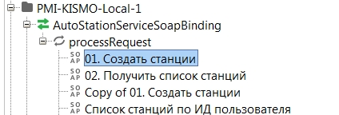

- PMI-Kismo-Local - проект;
- AutoStationServiceSoapBinging - интерфейс;
- 01 Создать станции - запрос

## Из чего сделан адрес веб-сервиса обработчиков

Адрес веб-сервиса составлен из нескольких частей. Например для сервисов на WildFly:
http://192.168.65.60:8330/Services/AutoStationService?wsdl ,
где:

- [http://192.168.65.60:8330](http://192.168.65.60:8330/) - адрес сервера, на котором развернуты обработчики (уточнять у разработчиков, по таблице IP-адресации, опытным путем :));
- `/Services/` - общая часть для всех сервисов
- `AutoStationService?wsdl` - название файла с описанием сервиса.

В SoapUI адрес сервиса указывается в нескольких местах:

- в строке адреса запроса - это основной адрес. В большинстве случаев, достаточно поменять только этот адрес (например, просто поменять порт или IP). В этом поле адрес указывается без окончания `?wsdl` (например: http://192.168.65.60:8330/Services/AutoStationService)

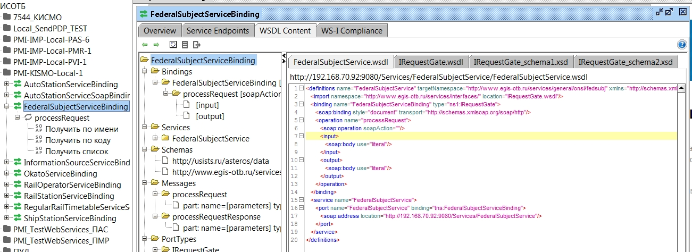

- в строке Definition URL свойств интерфейса (отображается в нижней части левой панели при выделенном интерфейсе). В этой строке указывается адрес с окончанием `?wsdl` (или `.wsdl` для WAS)

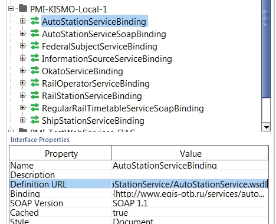

- в окне редактирования интерфейса на вкладке **Service Endpoint**. Эта строка обновляет все адреса запросов. Здесь указывается адрес без окончания `?wsdl`:

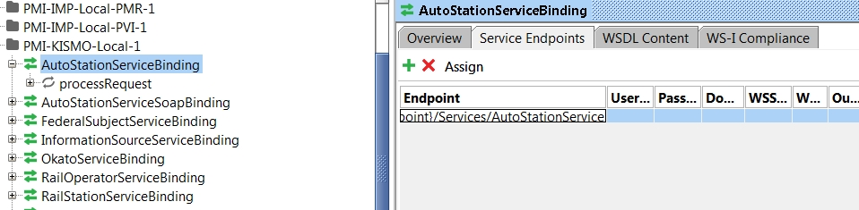

Из WSDL загружается описание сервиса (структура запроса, вспомогательные схемы). SoapUI загружает описание один раз и сохраняет его в файле проекта. Это можно увидеть, нажав два раза по *интерфейсу* (узел с зелеными стрелочками) и переключившись на вкладку WSDL-контент.


Для сервисов на WAS адрес сервиса может быть таким (такой формат можно видеть в старых проектах SoapUI:
http://192.168.70.92:9080/Services/AutoStationService/AutoStationService.wsdl
, где

- [http://192.168.70.92:9080](http://192.168.70.92:9080/) - адрес обработчиков на WAS;
- `/Services/` - общая для всех сервисов часть;
- `AutoStationService/` - название "папки" в которой лежит файл. Для каждого сервиса своя;
- `AutoStationService.wsdl` - название файла с описанием сервиса.

Веб-сервисы также есть у ПУДа (для записи ПДП в обход обработчиков) и у шлюзов.

## Как заменить адрес старого сервиса и обновить Definitions Part

В старых проектах в разделе Definition Parts можно видеть старые адреса.
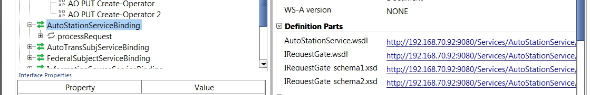

Их можно обновить без пересоздания интерфейса. Для этого:

- Выбрать интерфейс, который нужно обновить.
- В нижней части левого окна в строке **Definition URL** посмотреть адрес. Для старых проектов это может быть так:
  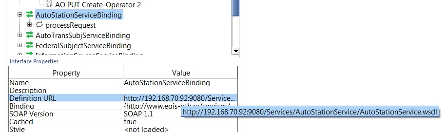

- Это адрес к старым сервисам. Нужно обновить его на новый адрес, например, вставим туда новый адрес тестовой зоны: http://192.168.65.60:8330/Services/AutoStationService?wsdl (в старых проектах может быть лишняя папка в пути и .wsdl вместо ?wsdl)
- После этого этого кликнуть правой кнопкой по интерфейсу и нажать **Update Definitions** (или кнопку F5).
- В появившемся окне нажать **Ок**, ничего не менять (там будет стоять только одна первая галочка).
- Появится окошко с восклицательным знаком **Missing matching binding**. Просто нажать Ок.
- Появится окошко с запросом на обновление интерфейса ("*Update existing requests with new endpoints?*"). Нажать **Ок**.
- Интерфейс обновится, обновятся Definition Parts.

## Программы и утилиты

- [SoapUI](https://www.soapui.org/) - основная утилита для отправки запросов к веб-сервисам
- [Notepad++](https://notepad-plus-plus.org/) - вспомогательная утилита, блокнот для редактирования
- Расширение для браузера: Wizdler ([Chrome](https://chrome.google.com/webstore/detail/wizdler/oebpmncolmhiapingjaagmapififiakb?hl=en), [Firefox](https://addons.mozilla.org/en-US/firefox/addon/wizdler/)). Позволяет строить примеры запросов из wsdl/xsd прямо в браузере.

В Notepad++ понадобятся следующие базовые команды:

- для того чтобы в XML-файле подсвечивался синтаксис: в меню Синтаксисы > XML;
- чтобы сериализовать (конвертировать) часть текста в base64 (это нужно для передачи сервису файлов ПДП) - нужно выбрать текст, кликнуть правой кнопкой мыши и выбрать **"Plugin Commands"** > **"Base64 Encode"**. Например:

обычный текст: мама мыла раму
тот же текст в base64: `0LzQsNC80LAg0LzRi9C70LAg0YDQsNC80YM=`

- чтобы "расшифровать" текст, нужно выделить его, кликнуть правой кнопкой мыши и выбрать "Plugin Commands" > "Base64 Decode"

Плагины к Notepad++ - для установки плагинов перейти в меню "Плагины" > "Plugin Manager" и установить:

**XML Tools** - плагин для работы с XML-файлами. Полезные команды:

- Check XML Syntax - проверяет базовый синтаксис XML, может найти ошибки вроде незакрытого тэга или лишнего символа;
- Pretty Print (XML Only) - делает XML-ку красивой и читаемой расставляя в нужных местах отступы и табуляции;
- Convert selection XML to text - экранирует XML-символы (вместо символов < > ставит везде < и > ). Применяется к выделенному тексту.
- Convert selection text to XML - операция, обратная предыдущей
- Comment selection / uncomment selection - закомментировать выделенный текст (например, если требуется временно "деактивировать" часть файла, чтобы она не обрабатывалась, но совсем удалять не хочется)
- Validate - проверяет структуру файла по указанному XSD.

Пример работы Wizdler'a на сервисе UserService.wsdl:

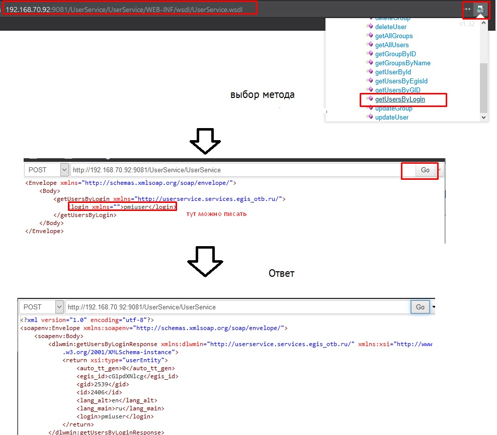


## SoapUI: основные элементы интерфейса

1. Дерево проектов. Тут перечислены все открытые проекты.
2. Свойства выделенного объекта (проекта, интерфейса, запроса)
3. Основное поле запроса. Открывает двойным нажатие по запросу в панели слева. Это то, что мы отправляем сервису
4. Здесь отображается ответ, который приходит от сервиса
5. Основные панели меню

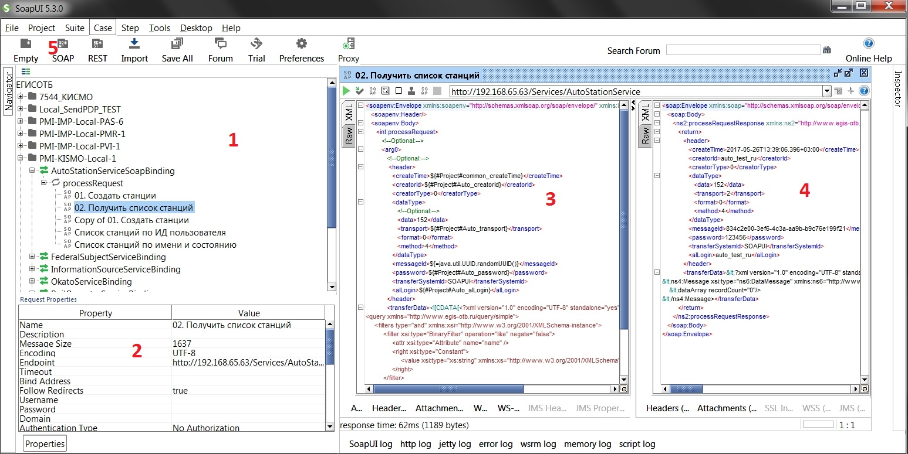

Также сразу рекомендую **настроить функцию автосохранения** (по умолчанию отключена). Для этого перейти в File > Preferences > выбрать "UI Settings" > в поле "AutoSave Interval:" поставить нужное значение в мин. Если открыто много проектов, то автосохранение каждые n минут может подтормаживать (10-15 проектов переваривает незаметно для работы).

### SoapUI: как создать, сохранить и открыть проект

Чтобы **Создать новый проект**, нужно просто нажать кнопку **"Empty"** в панели меню или выбрать в меню **"File"** пункт **"Create Empty Project"**. Пустой проект появится в списке слева.

Чтобы **переименовать** проект, нужно кликнуть по нему правой кнопкой мыши и выбрать в меню **"Rename"** (или нажать кнопку f2 на клавиатуре).

Чтобы **добавить в проект** новый интерфейс нужно:

1. нажать правой кнопкой мыши по проекту и выбрать пункт **"Add WSDL"**;
2. в открывшемся окне ввести адрес веб-сервиса (путь к файлу wsdl), например: http://192.168.65.60:8330/Services/AutoStationService?wsdl и нажать ОК;
3. новый интерфейс появится в проекте. Если раскрыть узел созданного интерфейса, будет видно узел processRequest (для обработчиков), внутри которого создан шаблон запроса. Его можно открыть двойным кликом - справа откроется окно (слева - запрос, справа - ответ

Чтобы **сохранить проект**, нужно нажать по нему правой кнопкой мыши и выбрать пункт **"Save Project"**. Указать путь, куда сохранить проект. Проект сохраняется в формате XML. Все проекты можно сохранить, выбрав в меню **File** пункт **"Save All Projects"** (или нажать на клавиатуре Ctrl+Alt+S.

Чтобы **открыть проект** их XML файла, нужно нажать кнопку **Import** в панели меню и открыть файл проекта на локальном диске. Проект появится в списке проектов слева (его можно переименовать и пересохранить - Save Project As).

Если нужно **скопировать интерфейс** из одного проекта в другой, то:
нажать правой кнопкой мыши по интерфейсу, который нужно скопировать;

1. выбрать пункт **Clone Interface**;
2. в появившемся окне выбрать в выпадающем списке проект, куда нужно скопировать интерфейс и нажать ОК;
3. скопируется интерфейс и все его запросы.

Если в ходе отмены изменений (так много раз нажал **Ctrl + Z**, что ОМГ **все пропало**), то нужно всего лишь нажать **Ctrl + Y** и оно вернется (сочетание клавиш для Redo).

## Формат запроса

Запрос состоит из заголовка и основной части. Рассмотрим на примере. Это запрос (его можно целиком вставить в SoapUI) создает одну станцию:

```xml
<soapenv:Envelope xmlns:soapenv="http://schemas.xmlsoap.org/soap/envelope/" xmlns:int="http://www.egis-otb.ru/services/interfaces/">
    <soapenv:Header/>
    <soapenv:Body>
        <int:processRequest>
            <!--Optional:-->
            <arg0>
                <!--Optional:-->
                <header>
                    <createTime>2017-05-26T13:39:06.396+03:00</createTime>
                    <creatorId>auto_test_ru</creatorId>
                    <creatorType>0</creatorType>
                    <dataType>
                        <!--Optional:-->
                        <data>152</data>
                        <transport>2</transport>
                        <format>0</format>
                        <method>1</method>
                    </dataType>
                    <messageId>ThisIsMessageId</messageId>
                    <password>123456</password>
                    <transferSystemId>SOAPUI</transferSystemId>
                    <alLogin>auto_test_ru</alLogin>
                </header>
                <transferData><![CDATA[<?xml version="1.0" encoding="UTF-8" standalone="yes"?>
<ns5:Message xsi:type="ns6:DataMessage" xmlns:ns7="http://www.egis-otb.ru/gtimport/" xmlns:ns5="http://www.egis-otb.ru/datatypes/" 
xmlns:ns6="http://www.egis-otb.ru/messaging/" xmlns:ns2="http://www.egis-otb.ru/data/timetable/delta/" 
xmlns:xsi="http://www.w3.org/2001/XMLSchema-instance" xmlns:ns3="http://www.egis-otb.ru/data/onsi/rail/countries/" 
xmlns:ns4="http://www.egis-otb.ru/data/onsi/stations/">
    <dataArray recordCount="1">
        <data sourceId="testKismoSAS01" xsi:type="ns7:ImportedEntry">
            <data xsi:type="ns4:AutoStation" 
            name="Кисмо Автостанция ЗСС 01" 
            shortName="КАЗСС01" shortLatName="KADSS01" 
            nearestTown="Кисмогород" 
            latitude="11.098765" 
            longitude="11.098765" 
            isuid="1883" 
            isgid="1281">
            <actualPeriod xsi:type="ns5:DateTimePeriod" to="2020-04-15T01:00:00.000Z" from="2014-04-15T00:00:00.000Z"/>
            <countryCode value="Российская Федерация" id="185" />
            <federalSubject value="Республика Карелия" id="10" />         
            <okato value="86000000000" id="1300033"/>
            <stationType>false</stationType>
            </data>        
        </data>        
    </dataArray>
</ns5:Message>]]></transferData>
            </arg0>
        </int:processRequest>
    </soapenv:Body>
</soapenv:Envelope>
```

### Заголовок запроса

Заголовок запроса размещается между тэгами <header> </header>, данные, которые необходимо передать обработчику - в поле </transferData>.
Рассмотрим заголовок:

```xml
<header>
    <createTime>2017-05-26T13:39:06.396+03:00</createTime>
    <creatorId>auto_test_ru</creatorId>
    <creatorType>0</creatorType>
    <dataType>
         <!--Optional:-->
         <data>152</data>
         <transport>2</transport>
         <format>0</format>
         <method>1</method>
     </dataType>
     <messageId>ThisIsMessageId</messageId>
     <password>123456</password>
     <transferSystemId>SOAPUI</transferSystemId>
     <alLogin>auto_test_ru</alLogin>
</header>
```


Способ кодирования информации в полях `creatorType`, `transport`, `format`, `method` описывается классами пакета `ru.usists.dispatcher` артефакта `xsd-classes`.

### Тело запроса. Пример создания станции

Тело запроса - собственно, данные, которые нужно передать обработчику.
Данные помещаются в поле <transferData> и в дополнительную обертку <![CDATA[ ... тут данные .... ]]>.

Рассмотрим запрос с созданием одной станции:

```xml
<transferData>
                <![CDATA[<?xml version="1.0" encoding="UTF-8" standalone="yes"?>
<ns5:Message xsi:type="ns6:DataMessage" xmlns:ns7="http://www.egis-otb.ru/gtimport/" xmlns:ns5="http://www.egis-otb.ru/datatypes/" 
xmlns:ns6="http://www.egis-otb.ru/messaging/" xmlns:ns2="http://www.egis-otb.ru/data/timetable/delta/" 
xmlns:xsi="http://www.w3.org/2001/XMLSchema-instance" xmlns:ns3="http://www.egis-otb.ru/data/onsi/rail/countries/" 
xmlns:ns4="http://www.egis-otb.ru/data/onsi/stations/">
    <dataArray recordCount="1">
        <data sourceId="testKismoSAS01" xsi:type="ns7:ImportedEntry">
            <data xsi:type="ns4:AutoStation" 
            name="Кисмо Автостанция ЗСС 01" 
            shortName="КАЗСС01" shortLatName="KADSS01" 
            nearestTown="Кисмогород" 
            latitude="11.098765" 
            longitude="11.098765" 
            isuid="1883" 
            isgid="1281">
            <actualPeriod xsi:type="ns5:DateTimePeriod" to="2020-04-15T01:00:00.000Z" from="2014-04-15T00:00:00.000Z"/>
            <countryCode value="Российская Федерация" id="185" />
            <federalSubject value="Республика Карелия" id="10" />         
            <okato value="86000000000" id="1300033"/>
            <stationType>false</stationType>
            </data>        
        </data>        
    </dataArray>
</ns5:Message>]]>
    </transferData>
```


В первой части запроса приведены **переменные пространств имен**. Нам здесь важно обратить внимания на переменные:

- **ns7**="http://www.egis-otb.ru/gtimport/" - эта переменная будет во всех запросах на создание (станций, операторов, раписаний;
- **ns4**="http://www.egis-otb.ru/data/onsi/stations/" - это только для станций
- **ns6**="http://www.egis-otb.ru/datatypes/" - для всех запросов.

Переменные указанные в первой части, должны совпадать по всему запросу. Из примера выше видно:

- указан тип данных `ns7:ImportedEntry`;

- указан тип записи (это автостанции) - `ns4:AutoStation`.

  ```
  <data sourceId="testKismoSAS01" xsi:type="ns7:ImportedEntry">
              <data xsi:type="ns4:AutoStation" 
  ```

Если какие-то пространства будут не совпадать, то запрос вернется с ошибкой типа "_Ошибка при обработке запроса: javax.xml.bind.UnmarshalException: Unable to create an instance of ru.egis_otb.datatypes.DataRecord_"

Далее идет блок с **количеством записей**, которые передаются в запросе: `<dataArray recordCount="1">`. Тут просто, сколько здесь указано записей, столько и будет обработано. То есть, если вы передаете 5 станций, а в recordCount указано "2", то обработано и записано в базу будет только первые две станции.

После этого идет обычный блок <data> с **данными станции**. Отличия от шлюзов и тестов на САТ:

- это необязательно, но все же лучше указывать в **sourceId** что-нибудь читаемое, уникально для теста, например - testKismo456,testKismo457. В этом случае вам просто будет найти ваши данные в базе, просто удалить и при переносе тестов на СГК не возникнет ошибки с дублированием записей (ну потому что sourceId="001" уже везде есть;

- **isuid** и **isgid** - это идентификатор и идентификатор группы пользователя (того, что указан в поле creatorId). Как их узнать написано в разделе ниже;

- `countryCode`, `federalSubject`, `okato` - здесь должно быть указано как значение (значение при этом может быть любым не пустым, но лучше нормальные все таки писать), так и идентификатор.

  Например, чтобы записать страну:

  ```
  <countryCode value="Российская Федерация" id="185" />
  ```

  Окато:

  ```
  <okato value="86000000000" id="1300033"/>
  ```

Идентификатор ОКАТО можно посмотреть по базе данных в таблице `GENERAL_ONSI.CLASS_OKATO` (поле CODE - 11 цифр кода окато, ID - идентификатор, который должен быть указан в запросе).
Также идентификатор можно запросить у сервиса OkatoService по имени или коду. Пример такого запроса указан ниже (поиск по коду 01204859002):

```xml
<soapenv:Envelope xmlns:soapenv="http://schemas.xmlsoap.org/soap/envelope/" xmlns:int="http://www.egis-otb.ru/services/interfaces/">
    <soapenv:Header/>
    <soapenv:Body>
        <int:processRequest>
            <!--Optional:-->
            <arg0>
                <!--Optional:-->
                <header>
                    <createTime>2017-05-26T13:39:06.396+03:00</createTime>
                    <creatorId>auto_test_ru</creatorId>
                    <creatorType>0</creatorType>
                    <dataType>
                        <!--Optional:-->
                        <data>0</data>
                        <transport>2</transport>
                        <format>0</format>
                        <method>4</method>
                    </dataType>
                    <messageId>ThisIsMessageId</messageId>
                    <password>123456</password>
                    <transferSystemId>SOAPUI</transferSystemId>
                    <alLogin>auto_test_ru</alLogin>
                </header>
                <transferData>
                <![CDATA[<?xml version="1.0" encoding="UTF-8" standalone="yes"?>
<query xmlns="http://www.egis-otb.ru/query/simple">
    <filters type="and" xmlns:xsi="http://www.w3.org/2001/XMLSchema-instance">
        <filter xsi:type="BinaryFilter" operation="eq" negate="false">
            <attr xsi:type="Attribute" name="code" />
            <right xsi:type="Constant">
                <value xsi:type="xs:string" xmlns:xs="http://www.w3.org/2001/XMLSchema">01204859002</value>
            </right>
        </filter>
    </filters>
    <maxResults>5</maxResults>
</query>]]>
    </transferData>
            </arg0>
        </int:processRequest>
    </soapenv:Body>
</soapenv:Envelope>
```

### Формат запросов поиска (GET 4)

Помимо создания (метод *PUT* - 1) сервисы также поддерживают метод GET (получить), с помощью которого можно искать записанные данные. Рассмотрим пример с поиском станции по имени.

```xml
<soapenv:Envelope xmlns:soapenv="http://schemas.xmlsoap.org/soap/envelope/" xmlns:int="http://www.egis-otb.ru/services/interfaces/">
    <soapenv:Header/>
    <soapenv:Body>
        <int:processRequest>
            <!--Optional:-->
            <arg0>
                <!--Optional:-->
                <header>
                    <createTime>2017-05-26T13:39:06.396+03:00</createTime>
                    <creatorId>auto_test_ru</creatorId>
                    <creatorType>0</creatorType>
                    <dataType>
                        <!--Optional:-->
                        <data>152</data>
                        <transport>2</transport>
                        <format>0</format>
                        <method>1</method>
                    </dataType>
                    <messageId>ThisIsMessageId</messageId>
                    <password>123456</password>
                    <transferSystemId>SOAPUI</transferSystemId>
                    <alLogin>auto_test_ru</alLogin>
                </header>
                <transferData>
                <![CDATA[<?xml version="1.0" encoding="UTF-8" standalone="yes"?>
<query xmlns="http://www.egis-otb.ru/query/simple">
    <filters type="and" xmlns:xsi="http://www.w3.org/2001/XMLSchema-instance">
        <filter xsi:type="BinaryFilter" operation="like" negate="false">
            <attr xsi:type="Attribute" name="name" />
            <right xsi:type="Constant">
                <value xsi:type="xs:string" xmlns:xs="http://www.w3.org/2001/XMLSchema">КИСМО%</value>
            </right>
        </filter>        
    </filters>
    <maxResults>6</maxResults>
</query>]]>
    </transferData>
            </arg0>
        </int:processRequest>
    </soapenv:Body>
</soapenv:Envelope>
```

Как видно, заголовок почти такой же как для метода PUT (1) . Отличие: в поле <method> указано не 1, а 4. В поле `transferData` передается запрос на поиск (или "фильтр"). Все возможные значения в этом поле описаны в xsd-схеме.

Этот запрос делает две вещи: ищет все станции, начинающиеся с КИСМО и выводит только 6 результатов (maxResults). Рассмотри фильтр по имени:

```
<filters type="and" xmlns:xsi="http://www.w3.org/2001/XMLSchema-instance">
        <filter xsi:type="BinaryFilter" operation="like" negate="false">
            <attr xsi:type="Attribute" name="name" />
            <right xsi:type="Constant">
                <value xsi:type="xs:string" xmlns:xs="http://www.w3.org/2001/XMLSchema">КИСМО%</value>
            </right>
        </filter>        
</filters>
```

- тэг <filters> </filters> - поле для перечисления фильтров. Внутри может быть перечислено несколько фильтров. **Логическая операция** над фильтрами указывается в атрибуте **type=**. В данном случае это <filters type="and" - то есть все перечисленные фильтры в поле <filters> (у нас он один) должны быть выполнены. Возможные значения: and (И), or (ИЛИ);
- `<filter xsi:type="BinaryFilter" operation="like"` - здесь указан тип фильтра (бинарный BinaryFilter). Все типы фильтра указаны в query.simple.xsd, для поиска чаще всего используется бинарный. В некоторых сервисах удобнее использовать QueryFilter. В operation="like" указана операция, которая должна быть выполнена. Для бинарного типа возможные значения: eq ("="), ne (не равно), like (похож), lt (меньше), gt (больше), le (меньше или равно), ge (больше или равно). В данном случае указана операция like, чтобы найти все станции, которые начинаются на КИСМО. Если нужно найти по точному значению - то тут указывается оператор "eq" (equal - равно)
- <attr xsi:type="Attribute" name="name" /> - здесь в атрибуте name= указывается собственно поле, по которому нужно выполнить поиск. В данном случае это имя станции (name). Может быть указано любое другое поле, например sourceId, или nearestTown и т.д.
- `<value xsi:type="xs:string"` - здесь указан тип данных. Для имени (name) - это string (строковое значение). Для каких-то других полей это может быть другой тип, например xs:short, xs:long,xs:integer. Я в основном выясняю опытным путем, но вообще все типы полей описаны в соответствующих XSD схемах (например, для поля статус (state) тип данных xs:short);
- `КИСМО%</value>` - собственно само значение, по которому выполнить поиск. В данном случае - начальные буквы станции с %, который заменяет все остальные возможные символы.

* <maxResults>6</maxResults> - это простой запрос, который выводит только 6 результатов. Также можно еще использовать сортировку, например `order`.

Ниже приведен пример запроса расписания, который выводит одно расписание с указанным именем и в состоянии active.

```
<transferData>
<![CDATA[<?xml version="1.0" encoding="UTF-8" standalone="yes"?>
<query xmlns="http://www.egis-otb.ru/query/simple">
    <filters type="and" xmlns:xsi="http://www.w3.org/2001/XMLSchema-instance">
        <filter xsi:type="BinaryFilter" operation="eq" negate="false">
            <attr xsi:type="Attribute" name="name" />
            <right xsi:type="Constant">
                <value xsi:type="xs:string" xmlns:xs="http://www.w3.org/2001/XMLSchema">ИМЯРАСПИСАНИЯТУТА</value>
            </right>
        </filter>
        <filter xsi:type="BinaryFilter" operation="eq" negate="false">
            <attr xsi:type="Attribute" name="state" />
            <right xsi:type="Constant">
                <value xsi:type="xs:short" xmlns:xs="http://www.w3.org/2001/XMLSchema">0
                </value>
            </right>
        </filter>
    </filters>
    <maxResults>1</maxResults>
</query>]]>
</transferData>
```

## Расширенные свойства проектов, параметризация

### Использование java классов в проекте: UUID

В SoapUi есть возможность вставлять в запросы код java в определенном формате. Для чего это нужно? Самый простой пример - автоматическая генерация `messageId` (поле messageId в заголовке файле).

Вставка кода или переменной вместо значения в запрос выполняется в следующем формате. Начало кода предваряет символ доллара (`$`), java код или переменная записываются в фигурные скобки `{}`.

```
${какая-то java фича}
```

Например, функция генерации случайного идентификатора (UUID):

```
=java.util.UUID.randomUUID()
```

Вставляем ее прямо в запрос в заголовок в поле <messageId>:

```
<messageId>${=java.util.UUID.randomUUID()}</messageId>
```

Теперь при каждой отправке сообщения в этом поле будет генерироваться рандомный идентификатор, и ничего не нужно менять руками.

### Использование java классов в проекте: Текущая дата

Методы java Date, Calendar и SimpleDateFormat, конечно, были хороши (нет), но сильно устарели. Отныне и впредь правильно использовать для всего, связанного со временем, класс `java.time`. Примеры и описание на русском можно [почитать тут](https://javadevblog.com/polnoe-rukovodstvo-po-java-8-date-time-api-primery-localdate-instant-localdatetime-parse-i-format.html) . Старые примеры ниже под катом, они будут работать. Но поглядите, какие новые красивые.

В заголовке запроса есть поле <createTime>. В нем проставляется какая-то дата, ее можно проставлять и менять руками, а можно генерировать автоматически. Для этого вставляем в поле формулу:

```
${=java.time.LocalDateTime.now().toString()}
```

Результат: `<createTime>2020-03-23T12:26:44.2644+03:00</createTime>`

Дата сразу сгенерируется в нужном формате.

Если нужно отнимать и добавлять от текущей даты дни и часы, то теперь это проще простого:

```
# отнимаем часы
${=java.time.LocalDateTime.now().minusHours(3).toString()}
# добавляем дни
${=java.time.LocalDateTime.now().plusDays(1).toString()}
# отнимаем дни
${=java.time.LocalDateTime.now().minusDays(14).toString()}
```

Ну красота же? Форматирование даты под нужный нам вид, правда, все равно развесисто, но это не так часто требуется:

```
${=java.time.LocalDateTime.now().format(java.time.format.DateTimeFormatter.ofPattern("yyyy_MM_dd")).toString()}
```

А расчеты периодов теперь вообще просто сказка, но об этом в статье про автоматизацию. Целиком можно почитать [тут](https://www.baeldung.com/java-period-duration)

### Параметризация данных

Предположим у нас есть проект, который нужно перенести на другую площадку. Или надо поменять пользователя во всех запросов. А еще бывает что в тесте нужно сквозное именование (например, один и тот же sourceId используется в нескольких запросах на обновление удаление и поиск). А еще когда переносишь проект на другую площадку, хочется просто поменять ip в одном месте, и чтобы везде сразу поменялось.

Для всего в SoapUi можно использовать свойства проекта. В свойствах проекта можно указывать в виде переменных какие-то значения, которые используются в запросах постоянно, а в самих запросах просто делать ссылку на эту переменную. Например, можно создать переменную, в которой указан логин пользователя, который используется для отправки запроса. В самих запросах указывать переменную. А если нужно перенести запрос на другую площадку, изменить пользователя - просто изменить значение переменной, и везде во всех запросах логин изменится автоматически.

Свойства проекте можно посмотреть в нижней левой панели при выделенном проекте на вкладке **Custom Properties**. Должен быть выделен именно сам проект (папка проекта), а не, например, интерфейс или запрос:

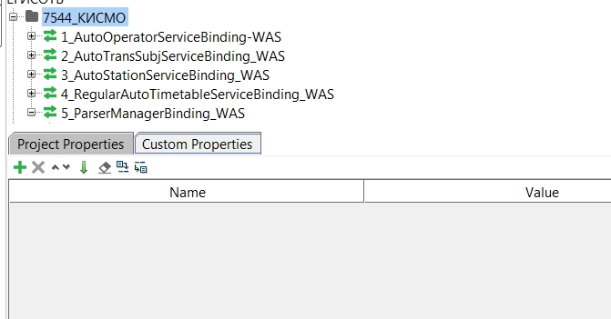

Сейчас в проекте нет никаких переменных. Чтобы создать переменную, нужно нажать пиктограмму с зелеными плюсиком. В поле **Name** указать какое-то название на латинице, в поле значение - указать значение. Например, создадим переменную для поля creatorId для автотранспорта.
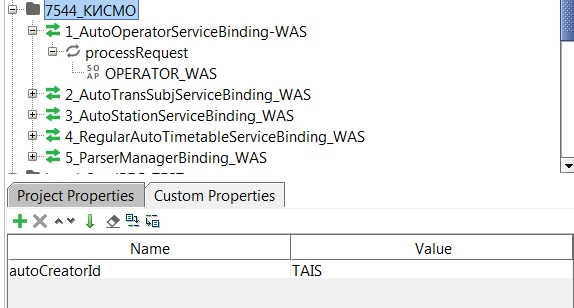

Чтобы использовать переменную в запросе, нужно сослаться на нее в формате:

```
${#Project#ИМЯПЕРЕМЕННОЙ}
```

где `ИМЯПЕРЕМЕННОЙ `- наша переменная, на картинке выше - это `autoCreatorId`. A `#Project` - указание, что ищем переменную в текущем проекте, обычно не меняется (можно ссылаться и на другой проект).

Теперь в самом запросе в поле creatorId заголовка вставим нашу переменную:

```
<creatorId>${#Project#autoCreatorId}</creatorId>
```

Теперь, если нужно поменять `creatorId` для всех запросов, достаточно просто поменять значение в **Custom Properties** проекта.
Но подождите, ведь с `creatorId` также связаны `isUid` и `isGid`, они тоже должны поменяться, если указан другой `creatorId`. Поэтому, нужно создать еще две переменные, в одной указать isUid, а в другой - isGid:
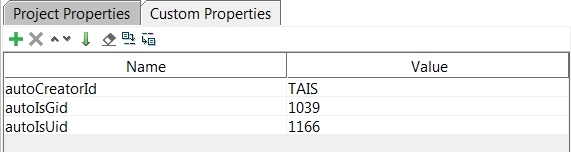

А в запросе (прямо в <transferData>) указать ссылку на эти переменные в соответствующих полях:

```
<data xsi:type="ns8:Operator" 
        <тут какие-то данные
        name="АВТОКОЛОННА 0000"         
        egisId="20100" 
        isuid="${#Project#autoIsUid}" 
        isgid="${#Project#autoIsGid}">
                <actualPeriod xsi:type="ns5:DateTimePeriod" to="2025-09-01T00:00Z" from="2015-09-01T00:00Z"/>            
<countryCode value="Российская Федерация" />
```

Таким образом можно параметризовать любые значения. Например, я люблю записывать в параметры IP-адрес, куда направлять запросы. Для этого нужно создать переменную, например ipAdr=192.168.65.60:8330:
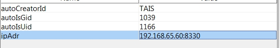

и указать эту переменную в поле **Definition Url** в свойствах интерфейса и в поле на вкладке **Service Endpoints** в **Interface Viewer** (двойной клик по интерфейсу). Для существующих запросов также можно поменять адрес запроса (как на картинке). Теперь, если мне нужно проверить запрос на другом IP-адресе, я просто меняют адрес и порт в переменной.

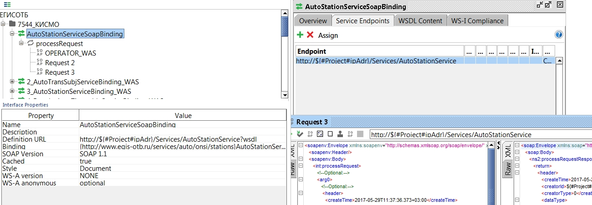

Все переменные из проекта можно сохранить (экспортировать) в файл. Для этого на вкладке **Custom Properties** проекта нужно нажать последнюю кнопку (там где зеленый плюсик). Все переменные будут сохранены в файл. Предпоследняя кнопка позволяет загрузить переменные из файла.

### XPath для проверок и параметризации

XPath в проверках и просто в запросах/свойствах (Assertion > XPath Match) позволяет обращаться к значением полей и атрибутов в ответе запроса и сверять их с заданными.

XPath удобно использовать, если нужно, например, получить значение из ответа и использовать его в следующем запросе, проверить конкретное значение в ответе запроса. Для каких-то простых одиночных полей проще использовать XPath, однако нужно помнить, что свойства, полученные ответа - динамические, и работают только после выполнения запроса и получения ответа.

- Также для этого можно использовать скрипт Groovy.
- Про пути XPath немножко можно прочитать в статье про автоматизацию.
- [Немножко примеров](https://www.w3schools.com/xml/xpath_examples.asp).

В запросе в **Assertions** добавим *XPath Match*. В верхней части нужно ввести путь к значению, в нижней ожидаемый результат.
Сверху есть кнопка **Declare** (надпись), при нажатии которой в верхний запрос автоматически добавляются нужные неймспейсы. Я стараюсь составлять запрос так, чтобы они были не нужны.
В поле **Expected Result** тоже есть кнопка-надпись - *Select from current*, которая выполняет XPath выражение и отображает результат в нижнем поле. Для проверки в нижнем поле можно использовать регулярные выражения и wildcards (например, "*" - для всех символов, ? - для любого одного [и т.д.](https://en.wikipedia.org/wiki/Wildcard_character)

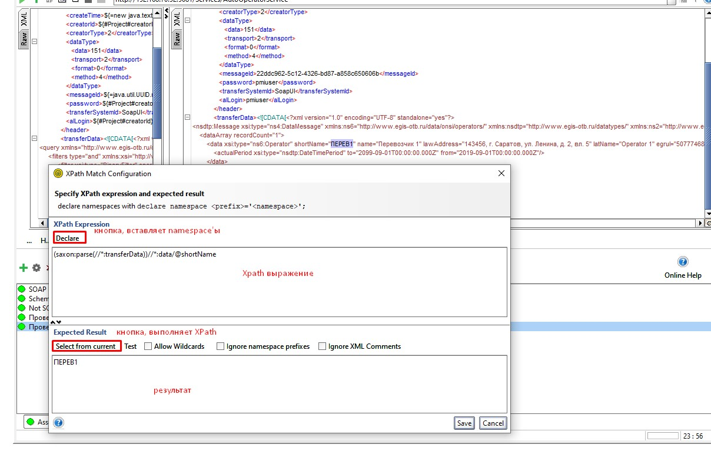

Для примера я выполнила запрос на чтение перевозчика. В ответе возвращен стандартный егисовский xml с `transferData`, внутри `transferData` - XML-ка с нужной информацией. Получить любое значение поля ответа XML достаточно просто. Например, получим messageId из заголовка (text() - позволяет прочитать значение как строчку):

```
//*:header/messageId/text()
```

Или creatorId: `//*:header/creatorId/text()`

Чтобы читать значение внутри CDATA (в поле transferData) у SoapUI есть фича - saxon, - парсер XML, который можно использовать в выражении XML. В SoapUI используется версия 9.1 (вроде как). Прочитаем значение shortName перевозчика в transferData:

```
(saxon:parse(//*:transferData))//*:data/@shortName
```

Все. Выражение в скобках сохраняет данные из transferData как XML, и дальше можно ходить по дереву XML как по папкам.

XPath также можно использовать для [расширения свойств](https://www.soapui.org/scripting-properties/property-expansion.html). Это достаточно удобная, но очень куцо документированная фича, которая позволяет обращаться к ответу или запросу прямо из ссылки на свойства. Например, в запросе мы можем обратиться к свойству тест-кейса из запроса вот так: `${#TestCase#propertyName}`.

Таким же образом можно обратится к шагу, а также, получить Response этого шага (Response - это такое же свойство). Вот так: `${Название шага#Response}`

Название шага без кавычек, как есть. Далее мы можем расширить свойство и обратиться к значению поля XML-ответа:

```
${Прочитать#Response#//*:createTime/text()}
```

Получим текст из поля `createTime` ответа из шага теста **Прочитать**. Добавим сюда saxon и прочитаем поле `name` из ответа:

```
${Прочитать#Response#//(saxon:parse(//*:transferData))//*:data/@name}
```

В месте, где вставлено свойство, будет вызвано значение поля ответа из указанного шага. Это выражение также можно вставить в свойство тест-кейса, и обращаться к свойству - так тоже будет работать.